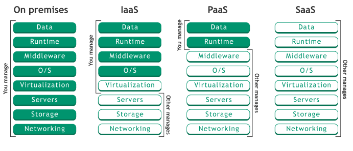

# AWS
## Cloud
### Cloud Computing의 등장배경
* 클라우드 등장 이전에는 전산실 등에 컴퓨터를 배치하고 인터넷을 연결하여 서비스를 제공했다. (온프레미스)
* 서버가 요청에 대한 수용 능력이 한계에 도달할 경우, 더 많은 컴퓨터를 사용하거나, 컴퓨터의 성능을 높이는 방식을 이용해야 했다.
* 이러한 방법의 단점들이 많다.
  * 주기적인 관리가 필요하다. (관리하는 인력 및 비용이 필요함)
  * 공간의 한계가 있다. (서버실이라는 공간이 필요함)
* 이러한 단점으로 인해 따로 데이터 센터를 만드는 기업들이 있었고, 이 데이터 센터의 자원을 대여하는 서비스가 등장하기 시작했다.
* 이로 인해 서버의 자원, 공간, 네트워크 환경을 빌려 사용하는 클라우트 컴퓨팅이 생겨났다.
### Cloud Computing
* 클라우드 컴퓨팅은 이전의 온프레미스 방식과 비슷한 역할을 하지만, 물리적인 컴퓨터가 아닌 가상 컴퓨터를 대여한다는 점이 다르다.
* 가상화(Virtualization) 기술의 발전으로 부터 시작되었다.
* 최근의 가상화 기술을 사용하는 클라우드 서비스는 기존의 온프레미스 방식과는 다른 **장점**이 있다.
  * 필요할 때마다 컴퓨팅 능력을 유연하게 조절할 수 있다.
  * 고정적인 비용이 들어가는 온프레미스와는 달리 사용한 만큼의 요금만 지불하면 된다.
  * 컴퓨터의 스냅샷을 이용해 다른 컴퓨터로 즉시 이주할 수 있다.
* 물론 장점만 있는건 아니고, **단점**도 있다.
  * 운영환경 자체가 클라우드 제공자에게 종속되어 버리므로, 클라우드 서비스에 문제가 생기면 내가 관리하는 환경에도 영향이 미친다.
  * 또한 특정 회사의 기술로만 구성해야 하는 경우가 발생할 수도 있다.

## 클라우드 서비스의 형태

* 대표적인 클라우드 서비스의 형태는 SaaS, IaaS, PaaS 세가지이다.
### IaaS(Infrastructure as a Service)
* 클라우드 제공자가 가상컴퓨터까지 제공하는 경우 IasS에 해당한다.
* ex) AWS의 EC2, S3

### PaaS(Platform as a Service)
* 클라우드 제공자가 데이터베이스, 개발 플랫폼까지 제공하는 경우 PaaS에 해당한다.
* ex) 날씨 API와같은 API서비스

### Saas(Software as a Service)
* 클라우드 제공자가 당장 사용 가능한 소프트웨어를 제공하는 경우 SaaS에 해당한다.
* ex) Google Docs

## Deployment
* 배포란 개발한 서비스를 사용자들이 이용 가능하게 하는 과정이다.
* 기본적으로 4단계를 거쳐 개발한 서비스를 배포하게 된다.
### Development
* Local 컴퓨터 환경에서 개발 및 테스트를 한다.
* 개발단계로, 실제 데이터를 이용하지 않고 더미데이터를 이용해서 테스트한다.
* 변경사항이 있어도 문제가 되지 않는다.
* 모든 구성원이 각자의 환경에서 진행한다.

### Integration
* 각자 환경에서 개발된 부분을 취합하는 과정이다
* 작성한 코드가 다른코드에 문제를 발생시키지 않는지, 코드간 Conflict가 없는지 확인하는 단계이다.

### Staging
* 실제 출시 단계인 Prodcution단계와 가장 유사한 환경에서 테스트를 진행한다.
* 실제 데이터를 복사해 문제가 있지 않은지 다양한 환경에서 테스트를 진행한다.
* 모든 관계자들에게 검증하는 단계이다.

### Production
* 개발된 서비스를 출시하는 단계이다.
* 사용자가 접속할 수 있는 Production환경에서 코드를 구동하고 서비스를 제공한다.
* 실제 데이터를 가지고 서비스가 운영되기 때문에 문제가 생기면 안된다.

### 배포과정 중 고려사항
* 개발부터 배포까지 모든것을 통제할 수 있는 상황이라면 문제없이 Production환경을 구성할 수 있다.
* 하지만 여러명이 함께 작업하는 프로젝트의 경우, node버전도 제각각이고, 인증정보나 DB등에 접근하기 위해 사용하는 엔드포인트도 모두 제각각이다.
* 따라서 배포에서는 환경의 차이를 이해하고, 환경 설정을 코드와 분리하는것이 좋다.
* 작성한 코드가 다른 환경에서 정상 작동할 수 있게 하려면 설정을 환경변수에 저장해야 한다.
* 개발 서버에서 코드상의 모든 곳에 절대경로가 아닌 상대경로를 사용하거나, `.properties` 등을 이용해 환경변수를 설정해야 한다.
* docker와 같은 개발 환경 자체를 통일시키는 솔루션을 사용할 수 있다.

### AWS에서의 Deploy Strategy
* **AWS에서 제공하는 서비스인 S3라는 서비스를 통해 사용자들에게 클라이언트를 제공**할 수 있다.
* 로컬 환경에서는 자체 개발 서버를 이용해 클라이언트 앱을 실행시키지만, 클라이언트를 정적 파일로 빌드하여 S3를 이용해 배포하면 된다.
* AWS에서 제공하는 CDN서비스인 **CloudFront를 통해 각지의 데이터센터에 데이터를 분산시켜 저장해놓고, 가까운 지역에서 데이터를 주는 방식으로 사용자에게 더 빠르게 서비스**를 제공할 수 있다.
* 사용자가 클라이언트 앱을 통해 요청을 전달할 서버의 경우, **AWS EC2서비스를 통해 손쉽게 서버를 제공**할 수 있다.
* 또한 AWS에선 Database 특화 서비스인 RDS서비스를 제공하고 있기 때문에, **RDS서비스를 이용하여 EC2를 통해 배포된 서버의 데이터를 저장, 제공하는 데이터베이스를 배포**할 수 있다.
* S3, EC2를 통해 배포된 서비스는 IP주소나 AWS에서 제공하는 긴 도메인 주소를 통해 접근하게 되는데, **AWS에서 제공하는 Route 53서비스를 이용하면 직관적인 도메인 주소를 통해 서비스에 접근**하도록 할 수 있다.

## AWS EC2(Elastic Computie Cloud)
* 아마존 웹 서비스에서 제공하는 클라우드 컴퓨팅 서비스이다.
* 즉, 아마존에서 가상의 컴퓨터를 한대 빌리는 것과 같다.
* 예를 들면 후불제 PC방과 같이 사용한 만큼의 비용을 지불하는 방식이기 때문에, Elastic이라는 단어가 붙어있다.
* 따라서 비용적인 부분뿐만 아니라, 필요에 따라 성능, 용량을 자유롭게 조절할 수 있다.
* EC2 서비스는 AWS에서 **비용, 성능, 용량 면에서 탄력적인 클라우드 컴퓨터를 제공하는 서비스**이다.

### EC2 장점
* PC를 직접 구매하는 것보다, 구성하는데 필요한 시간이 짧다. (몇번의 클릭만으로 PC를 구성할 수 있음)
* EC2에서는 **AMI(Amazon Machine Iamge)**라는 다양한 템플릿을 제공하고 있기 때문에, AMI를 통해 필요한 용도에 따라 다양한 운영체제에 대한 선택이 가능하다.
    * AWS에는 상당히 많은 양의 AMI 세팅이 준비되어 있기 때문에 손쉽게 운영체제를 구성할 수 있다.
    * 운영체제 뿐만 아니라 CPU, RAM, 용량까지도 손쉽게 구성할 수 있다.
* 컴퓨터를 한대 빌리는것과 같으므로, 컴퓨터로 할수 있는 모든 일을 할 수 있다.
    * 웹 서버를 설치하고, 사용자가 웹 브라우저를 통해 요청하는 서비스를 제공할 수 있다.
    * 인스턴스는 1대의 컴퓨터를 의미하는 단위이고, AWS에서 컴퓨터를 빌리는 것을 인스턴스를 생성한다고 한다.
    * 즉, 인스턴스를 생성한다는 것은 AMI를 토대로 운영체제, CPU, RAM, 런타임 등이 구성된 컴퓨터를 빌린는 것이다.

## RDS(Relational Database Service)
* AWS에서 제공하는 관계형 데이터베이스 서비스이다.
* EC2 인스턴스를 사용하면, 데이터베이스와 관련해서 자동으로 관리를 담당하는 부분이 매우 적기 때문에 사용자가 일일이 시간을 투자해 데이터베이스 엔진의 설치와 버전관리, 데이터 백업등을 해야한다.
* 또한 가용성과 내구성이 확보되지 않기 때문에 데이터베이스에 저장된 데이터가 유실되거나 정상적으로 사용하지 못할 수도 있고, 필요에따라 데이터베이스의 규모를 확장하기도 어렵다.
* RDS를 이용하면 데이터베이스 유지 보수와 관련된 일들을 RDS에서 전적으로 자동 관리한다.
* 사용자가 해야 할 일은 초기 설정을 제외하고, 데이터베이스에 저장된 데이터를 관리하는 일 밖에 없다. (매우 편리하다)
* 또한 다양한 데이터베이스 엔진 선택지를 제공하기 때문에, 필요한 데이터베이스 엔진을 선택하여 이용할 수 있다. (목적에 맞게 데이터베이스 엔진 선택 가능)

## S3(Simple Storage Service)
* 스토리지란 인터넷 공간에 데이터를 저장하는 저장소이다. (Google Drive, Naver MYBOX 등)
* 클라우드 스토리지 서비스의 장점은, 뛰어난 접근성을 갖고 있다는 것이다.
  * 웹 환경이라면 언제 어디서나 저장된 파일에 접근할 수 있고, 컴퓨터 뿐만 아니라 웹에 접속 가능한 다른 전자기기에서도 이용 가능하다.
* S3는 AWS에서 제공하는 클라우드 스토리지 서비스로, 위에 설명한 접근성 외에도 여러 장점들이 있다.
### S3 장점
* 접근성이 뛰어나다.
* 확장성이 높다.
  * 스토리지 규모를 확장/축소하기 쉽고, 용량을 무한히 확장할 수 있다. (비용만 지불)
* 내구성이 상당히 높다.
  * 저장된 파일을 유실할 가능성이 적어지고, S3는 거의 100%에 가까운 내구성을 보장한다.(99.999999999%)
* 가용성이 높다.
  * 가용성이 높으면 스토리지에 저장된 파일들을 정상적으로 사용할 수 있는 시간이 길어진다.
  * S3는 연간 99.99%의 스토리지 가용성을 보장한다. (대략적으로 1년에 8.76시간 동안만 장애가 발생)
* 다양한 스토리지 클래스를 제공한다.
  * 저장소를 어떤 목적으로 활용할지에 따라 효율적으로 선택할 수 있는 스토리지 클래스가 달라진다.
  * 대표적으로 많이 사용하는 스토리지 클래스는 Standard클래스와 Glacier클래스이다.
  * Standard클래스는 범용적인 목적으로 사용하기 좋으며, 데이터에 빠른 속도로 접근할 수 있고, 데이터 액세스 요청에 대한 처리속도가 빠르다. (보관비용은 비쌈)
  * Glacier클래스는 장기적인 보관목적으로 사용하기 좋으며, 저장된 데이터에 액세스하는 속도는 느리지만, 데이터를 보관하는 비용이 매우 저렴하다.
* 정적 웹사이트 호스팅이 가능하다.
  * 정적 웹 사이트 호스팅 : 서버의 개입없이 클라이언트에 제공될 수 있는 파일이 정적파일이며, 서버의 한 공간을 빌려주어 웹사이트의 배포, 운영이 가능하게 만들어주는 서비스가 웹호스팅이다.
  * S3에서는 **버킷**을 통해 정적 웹사이트 호스팅이 가능하다.
    > 버킷
    > * 버킷은 S3에 저장되는 파일들이 담기는 바구니로, 파일을 저장하는 최상위 디렉토리이다.
    > * 무한히 많은 파일을 저장할 수 있으며, 버킷의 이름은 각 리전(버킷 생성 지역)에서 유일해야 한다.
    > * 버킷 정책을 생성하여 해당 버킷에 대한 다른 유저의 접근 권한을 수정할 수 있다.
    > * 버킷에 담기는 파일을 객체라고 부르며, 키-값 형식으로 데이터를 저장한다.
    > * 객체는 파일과 메타데이터로 구성되어있으며, 파일은 키-값 형식으로 데이터를 저장하고, 메타데이터는 생성일, 크기, 유형같은 객체에 대한 정보가 담긴 데이터이다.
    > * 모든 객체는 고유한 URL주소를 갖고 있는데, URL 주소는 `http://버킷이름.S3.amazonaws.com/객체의키`형태이며 URL주소를 통해 원하는 데이터제 접근할 수 있다.

___
참고

https://www.whatap.io/ko/blog/9/

codestates 교육 자료