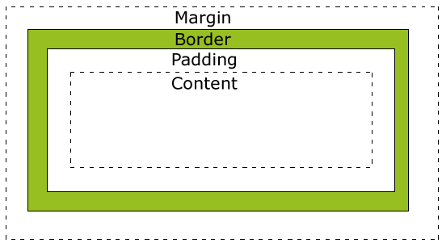

# CSS 기초

## 1. CSS란
Cascading Style Sheets로 웹페이지의 스타일링을 담당한다. 그러나 스타일링만을 위해 사용되지는 않고 웹페이지의 구성을 정돈하는 역할도 한다.

## 2. CSS의 구성 요소
CSS는 아래와 같은 요소들로 구성되어 있음
### 1) 선택자(Selector)
* CSS에서 HTML의 스타일을 적용할 때, 적용고자 하는 HTML 요소를 선택하는 수단이다.
### 2) 속성(property)
* 셀렉터로 HTML 요소를 선택하고 프로퍼티와 값을 지정하는것으로 다양한 style을 정의할 수 있다.
* 프로퍼티는 표준으로 이미 지정되어 있는 것을 사용하여야 한다.
### 3) 값(Value)
* 해당 프로퍼티에 사용할 수 있는 값을 말한다.


아래와 같은 구조로 사용된다.
```css
body {
  margin: 0;
  padding: 0;
  background: #fff;
  color: #4a4a4a;
}
```

`body`선택자

`margin, padding, background, color` 속성

`0, #fff, #4a4a4a` 값

## 3. HTML과의 연동
HTML은 CSS를 포함할 수 있다. CSS를 가지고 있지 않은 HTML은 그 브라우저에서 기본으로 적용하는 CSS(user agent stylesheet)로 설정된다.
>user agent stylesheet
> 
> 브라우저마다 설정되어있는 스타일 기본 값을 의미한다.

HTML과 CSS를 연동하는 방법은 3가지가 있다.
### 1) Link style
* HTML에서 외부에 있는 SCS파일을 로드하는 방식이다.
```html
<link rel="stylesheet" href="index.css" />
```

### 2) Embedding style
* HTML내부에 CSS를 포함시키는 방식이다.
* HTML과 CSS는 서로 역할이 다르므로 다른파일로 구분되어 작성하는게 좋기 때문에, Link style을 사용하는 편이 좋다.
* CSS코드가 너무 간단할 땐 사용할 수 있다고 한다.
```html
<style>
    h1 { color: red; }
    p  { background: aqua; }
</style>
```

### 3) Inline style
* HTML요소에서 style 속성에 CSS를 작성하는 방법이다.
* JavaScript가 동적으로 CSS를 생성할 때 사용하는 경우가 있다고 한다.
* 하지만 일반적인 경우엔 Link style을 사용하는편이 좋다고 한다.
```html
<nav style="background: #eee; color: blue">...</nav>
```

## 4. 셀렉터 기초

```html
h2{
    color : red;
}
```
위와같이 셀렉터를 지정하면 모든 `<h4>` 요소를 바꿔버린다.
이러면 변경을 원하지 않는 `<h4>`요소들도 다 스타일이 적용된다.
이런 상황에서 id나 class를 이용할 수 있다.
### 1) id
   * 아래와 같이 id를 이용한다.
      ```html
      <h1 id="first-title">This is first title.</h1>
      ```
   * 아래와 같이 #기호를 이용해 id가 있는 요소를 선택하고, 한 문서에서 한 요소에만 사용해야 한다.
      ```html
      #first-title {
        color: red;
      }
      ```

### 2) class
   * id는 한 문서에 한 요소에만 적용할수 있다. 하지만 여러 요소에 적용해야 될 필요가 있을 땐 class를 사용하면 된다.
      ```html
      <ul>
        <li class="list-style1">AAA</li>
        <li class="list-style1">BBB</li>
        <li class="list-style1">CCC</li>
        <li class="list-style1">DDD</li>
      </ul>
      ```
   * 아래와 같이 .을 이용해 class가 있는 요소를 선택한다.
      ```html
      .list-style1 {
         text-decoration: underline;
      }
      ```
   * 아래와 같이 여러개의 class를 공백으로 분리하여 하나의 요소에 적용할 수 있다.
      ```html
      <li class="list-style1 selected">ABCD</li>
      ```
### 3) id와 class의 차이점 정리

| id                 | class        |
|--------------------|--------------|
| #으로 선택한다           | .으로 선택한다     |
| 한 문서에 한 요소만 적용 가능  | 여러 요소에 적용 가능 |
| 특정 요소에 이름을 붙일 때 사용 | 스타일 분류에 사용   |
* class만 써도 될 것 같지만 그렇지 않고, 두가지 다 적절하게 사용해야 한다.
* id는 해당 페이지에서 그 이름이 유일해야 하는 경우에 많이 쓰이고, 개발단에서 해당 태그의 값을 찾아 낼 때도 더 좋다.


## 5. 텍스트 스타일링
### 1) 색상
* `color` 속성을 이용하면 된다.
* 값은 HEX(16진수로 RGB가 표헌된 값)이나 주요 색상 이름을 사용할 수 있다.
```css
.box{
    color: #115425;
    background-color : #d2ebd9;
    border-color: #c1e3c8;
}
```
### 2) 글꼴
* `font-family` 속성을 이용하면 된다.
* 글꼴의 이름은 "를 붙여 적용할 수 있다.
* 사용하려는 글꼴이 존재하지 않거나 디바이스에 따라 지원하지 않는 경우를 대비하여 ,로 구분하여 fallback 글꼴을 사용할 수 있다.
```html
.emphasize {
  font-family: "SF Pro KR", "MalgunGothic", "Verdana";
}
```
* 다양한 글꼴을 사용하고 싶으면 [Google Fonts](https://fonts.google.com/)를 참고

### 3) 크기
* `font-size` 속성을 이용하면 된다.

```html
.title {
  font-size: 21px;
}
```

> 알아야 할 단위
> * 절대 단위 : px, pt등 
> * 상대 단위 : %, em, rem, ch, vw, vh 등
> 
> [단위 참고 사이트](https://developer.mozilla.org/en-US/docs/Learn/CSS/Building_blocks/Values_and_units#numbers_lengths_and_percentages)
>
> 1. 절대적인 크기를 정할 때
>    * px을 사용한다. 
>    * 크기를 고정하는 단위이기 때문에 사용자 접근성이 불리하다.
>    * 인쇄와 같이 화면의 사이즈가 정해진 경우에 유리하다
> 
> 2. 일반적인 경우
>     * 상대단위인 rem을 사용한다
>     * em은 부모 엘리먼트에 따라 상대적으로 크기가 변경되므로 계산이 힘들다.
>     * rem은 root 글자 크기에 따라서만 상대적으로 변한다.
> 3. 반응형 웹에서 기준점을 만들 때
>     * width에 따라 유동적인 레이아웃이 적용되는 웹사이트를 말하며 보통 기준을 px로 정한다.
> 4. 화면 너비나 높이에 따른 상대적인 크기가 중요한 경우
>     * vw(viewport width), vh(viewport height)를 사용
>     * 화면을 가득 채우며 딱 떨어지게 스크롤 되는 사이트들은 100vw, 100vh를 사용해 구현한 것
### 4) 기타 스타일링 속성
* 굵기 : `font-weight`
* 밑줄, 가로줄: `text-decoration`
* 자간: `letter-spacing`
* 행간: `line-height`
* 정렬: `text-align`

## 6. 박스 모델
HTML의 엘리먼트들은 박스의 형태를 가지고 있는데 이러한 것들을 박스모델이라고 한다.

### 1) block vs inline
줄바꿈이 되는 **block** 박스, 줄바꿈이 일어나지 않고, 크기를 지정할 수 없는 **inline** 박스가 있다.
두 가지 특성이 섞인 **inline-block** 박스도 있다.

[[block element 목록]](https://developer.mozilla.org/en-US/docs/Web/HTML/Block-level_elements), 
[[Inline element 목록]](https://developer.mozilla.org/en-US/docs/Web/HTML/Inline_elements)

### 2) 박스를 구성하는 요소


위 사진과 같이 Border(테두리)를 기준으로 Padding(안쪽 여백)과 Margin(바깥 여백)이 있다.
1. Border(테두리)
   * Border는 심미적인 용도 외에도, 각 영역이 차지하는 크기를 파악하기 위해 레이아웃을 만들면서 그 크기를 시각적으로 확인할 수 있도록 만든다.
   * [border mdn](https://developer.mozilla.org/ko/docs/Web/CSS/border) 
   ```css
   p {
     border: 1px solid red;
   }
   ```
  
2. Margin(바깥 여백)
   * 각각 top, right, bottom, left 순서로 시계방향이다.
   ```css
   p {
     margin: 10px 20px 30px 40px
   }
   ```
   * 음수값을 지정하여 다른 엘리먼트와의 간격을 더욱 좁힐 수 있다.   
3. Padding(안쪽 여백)
   * border를 기준으로 박스 내부의 여백을 지정한다.
   ```css
   p {
     padding: 10px 20px 30px 40px;
   }
   ```

### 3) 박스를 벗어나는 경우
* 박스크기보다 콘텐츠크기가 더 큰 경우 콘텐츠가 박스 바깥으로 빠져나온다.
* 이러한 상황에서 `overflow` 속성을 사용할 수 있다.
```css
p {
  height: 40px;
  overflow: auto;
}
```
* `auto`값은 콘텐츠가 넘칠 경우 스크롤을 생성하도록 한다.
* 넘치는 콘텐츠를 보여주고 싶지 않으면 `hidden` 값을 이용한다.
* `overflow-x`와 `overflow-y`속성으로 축을 지정할 수 있다.

### 4) 박스 크기 측정 기준
처음 레이아웃 디자인을 할 때 박스에 적용할 여백을 고려하지 않고 박스의 크기를 디자인 하는 경우가 많다.

박스 크기의 측정 기준은 두가지로 나뉜다.
1) content-box
   * width로 지정된 값을 content 사이즈로 고정시킨다.
2) border-box
   * width로 지정된 값을 border 사이즈로 고정시킨다.
   * border-box로 설정해야 width와 실제로 차지하는 width와 같게 할 수 있다.


```css
* {
   box-sizing: border-box;
}
```

위와같이 `*`셀렉터를 이용해 모든 요소의 `box-sizing`속성을 `border-box`라는 값으로 설정해주면 된다.


___
참고

https://poiemaweb.com/

https://developer.mozilla.org/ko/docs/Web/CSS