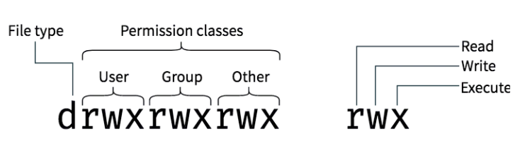

# Linux 기초

## 1. Linux 개념

### 1) CLI, GUI

>* 명령줄 인터페이스(Command-line Interface, CLI)
>
>* 그래픽 사용자 인터페이스(Graphic User Interface, GUI)

* GUI는 사용자가 쉽게 컴퓨터를 제어할수 있다는 장점이 있지만, CLI에 비해 느리고 그래픽등에 컴퓨터 자원을 많이 사용할 수 밖에 없다.

* Linux환경에서 CLI를 이용하는 방법은 개발자가 되기를 원하는 사람이라면 반드시 학습해야 한다.

### 2) Linux란?
* 리눅스란 Window나 MacOS같은 같은 컴퓨터 운영체제(Operation System, OS)이다.
* 다중 작업, 다중 사용자 시스템으로 설계됬다.
* Linux에서 일반적으로 구현되어야 하는 커널과 컴파일러 등의 유틸리티가 있는데, 
이것들을 활용해서 사용자들의 목적에 따라 배포판(Disturibution)을 만든다.
* 우분투, 레드햇, 페도라, 칼리 등이 있는데 이것들을 리눅스의 디스트로(distro)라고 한다.

#### 1. Linux의 장점
* 무료이다.
* 강력한 네트워크를 구축한다.
* 공개 운영체제이다.
* 안정적이다.
* 인터넷의 모든 기능을 지원한다.
* 하드웨어의 기능을 충분히 사용한다.
* 보안에 강력하다
* 개발 환경이 풍부하다.
* 유닉스와 호환가능하다.

#### 2.Linux의 단점
* 문제 발생시 보상받을 수 없다.
* 한글입출력에 어려움이 있다.
* 기술지원이 부족하다.
* 특정 하드웨어에 대한 자원이 부족하다
* 숙련된 기술이 필요하다.

## 2. 자주 사용하는 Linux 명령어
### 1) pwd
* print working directory의 약자로 현재 위치를 확인한다.
### 2) mkdir
* mkdir : make directory의 약자로 폴더를 만든다.
### 3) ls
* list의 약자로 특정 폴더에 포함한 파일이나 하위 폴더의 리스트를 출력한다.
* 자주 사용하는 옵션 `l`과 `a`가 있다.`ls -l`, `ls -a`, `-ls -al`
    * `a`는 all이라는 의미로 숨어있는 폴더나 파일을 포함한 모든 항목을 터미널에 출력한다.
    * `l`은 폴더나 파일의 포맷을 전부 표현하라는 의미다.
### 4) cd
* change directory의 약자로 폴더에 진입할 수 있다.
### 5) cat
* 파일의 내용을 출력하는 명령어 이다.
* 

### 5) touch
* 파일을 만들기 위한 명령어이다.

### 6) rm
* 파일을 지우기 위한 명령어이다.
* `rm -rf 폴더명`과 같이 `r`과 `f`를 같이 사용하면 폴더를 지울 수 있다.
  * `r` recursive
  * `f` force로

### 7) mv
* 파일의 이름을 바꾸거나 옮기기 위한 명령어다.
* `mv [폴더나 파일명] [도착 폴더명]` 과 같이 사용한다.

### 8) cp
* copy의 약자로 파일을 복사할 때 사용한다.
* `cp -rf [폴더명] [폴더명]`과 같이 `r`과 `f`를 같이 사용하면 폴더를 복사할 수 있다.

## 3. 사용자와 관리자
* Linux관리자의 큰 특징은 어떠한 일이 있더라도 일반 사용자에게 관리자(root) 권한을 완전하게 넘기지 않는다.
* 관리자 권한이 필요한 경우는 새로운 프로그램을 설치하거나, 프래그램을 변경 또는 삭제하는 경우 이기 때문에 그에 관련된 관리자 권한만 전달한다.

### sudo
* 사용자가 관리자 권한을 일시적으로 획득하는 명령어이다.
* `sudo apt install neofetch`, `sudo mkdir 파일명`과 같이 `sudo`를 이용해 관리자 권한으로 명령어 실행이 가능하다.

## 4. Read, Write, Execute 권한

* `ls -l`이라는 명령어를 입력 해보면 `-rw-r--r--`와 같은 출력을 확인 할 수 있다.
* 여기서 `r`은 읽기 권한, `w`은 쓰기 권한, `x`는 실행 권한이다.
* 아래 사진을 참고하면 이해가 빠르다.

1. user
   * 파일의 소유자로, 파일을 만든사람이 소유자가 된다.
2. group
    * 많은 사람이 파일에 액세스해야 하는 경우, user들을 group에 추가하고 파일에 group권한을 할당할 수 있다.
3. other
    * 파일을 만들지 않은 다른 모든 user들을 의미한다.
### chmod 명령어를 이용한 권한 변경
chmod 명령어를 이용하여 폴더나 파일의 읽기, 쓰기, 실행권한을 변경할 수 있다.

#### 1) `+` `-` `=`를 이용하여 `r` `w` `x` 권한을 변경

`chmod g+r 파일명` group `r`권한 추가

`chmod a=rw 파일명` 모두 `r` `w`권한만 부여

`chmod go-wx 파일멸` group, other `w` `x`권한 제거

#### 2) Absolute form을 이용하여 권한을 변경

  | Sum | `r` + `w` + `x` | rwx |
|---|-----------------|-----|
| 7 | 4 + 2 + 1       | rwx |
| 6 | 4 + 2 + 0       | rw- |
| 5 | 4 + 0 + 1       | r-x |
| 4 | 4 + 0 + 0       | r-- |
| 3 | 0 + 2 + 1       | -wx |
| 2 | 0 + 2 + 0       | -w- |
| 1 | 0 + 0 + 1       | --x |
| 0 | 0 + 0 + 0       | --- |
`chmod 744 파일명`과 같이 입력하면 `-rwxr--r--` 이 된다.

___
참고

https://hgserver.tistory.com/32

https://jiyongpark-dev.tistory.com/21

codestates 교육