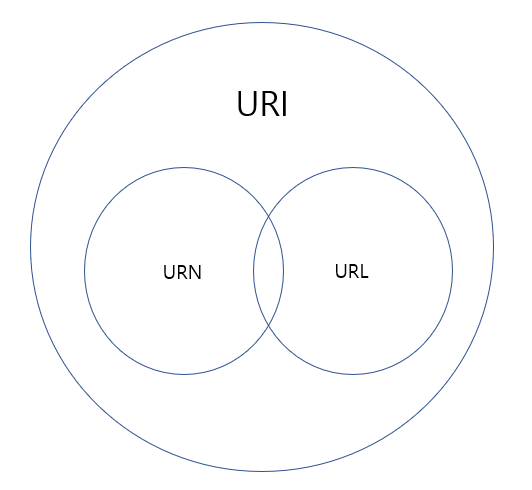

# Network

## Client Server Architecture
* 리소스가 존재하는 곳(서버)과 리소스를 사용하는 앱(클라이언트)으로 분리시킨 것을 2-Tier 아키텍처, 클라이언트-서버 아키텍처라고 부른다.
* 서버는 리소스를 전달해 주는 역할만 담당하고 리소스를 저장하는 공간을 별도로 마련해 두는데, 이 공간을 데이터 베이스라고 한다. 
  * 2티어 아키텍처에 데이터베이스가 추가된 형태를 3티어 아키텍처라고 부른다.
### HTTP를 이용한 클라이언트-서버 통신과 API
* 클라이언트-서버 아키텍처에서는 서버 마음대로 클라이언트에 리소스를 전달하지 않는다.
* 웹 애플리케이션 아키텍처에서는 클라이언트와 서버가 서로 HTTP라는 프로토콜을 이용해 통신을 한다.
  * 이 때 HTTP를 이용해 주고받는 메시지는 HTTP 메시지라고 부른다.
* 같은 일을 하더라도 다양한 프로토콜이 있을 수 있다.
* 프로토콜은 각자의 프로토콜마다 지켜야 하는 규약이 있다.
  * HTTP 메시지를 확인하면 HTTP만의 규칙이 있음을 알 수 있다.

### 주요 프로토콜
#### 응용 계층 (OSI 7 Layer)

| 프로토콜      | 설명                               |
|-----------|----------------------------------|
| HTTP      | 웹에서 HTML, JSON등의 정보를 주고받는 프로토콜   |
| HTTPS     | HTTP에서 보안이 강화된 프로토콜              |
| FTP       | 파일 전송 프로토콜                       |
| SMTP      | 메일을 전송하기 위한 프로토콜                 |
| SSH       | CLI 환경의 원격 컴퓨터에 접속하기 위한 프로토콜     |
| RDP       | Windows 계열의 원격 컴퓨터에 접속하기 위한 프로토콜 |
| WebSocket | 실시간 통신, Push 등을 지원하는 프로토콜        |

#### 전송 계층(OSI 4 Layer)

| 프로토콜 | 설명                                          |
|------|---------------------------------------------|
| TCP  | HTTP, FTP통신등의 근간이 되는 인터넷 프로토콜               |
| UDP  | 단방향으로 작동하는 훨씬 더 단순하고 빠르지만, 신뢰성이 낮은 인터넷 프로토콜 |

## API(Application Programming Interface)
* 서버는 클라이언트에게 리소스를 잘 활용할 수 있도록 인터페이스를 제공해줘야 하는데, 이것을 API라고 한다. (식당에서의 메뉴판)
* API는 클라이언트가 서버에서 제공하는 리소스를 모른다고 가정했을때, 엉뚱한 리소스를 요청하지 않도록 도와준다.
* 즉, 서버가 리소스 전달을 위한 API를 구축해 놓아야 클라이언트가 이를 활용할 수 있다.
* 보통 웹에서 데이터를 요청할 때에는 HTTP라는 프로토콜을 사용하며, 주소(URL, URI)를 통해 접근할 수 있다.

## HTTP 요청 메서드
* HTTP는 요청 메서드를 정의하여 주어진 리소스에 수행하길 원하는 행동을 나타낸다.
* HTTP동사 라고 부르기도 한다.
* 클라이언트가 웹 서버에게 사용자 요청의 목적/종류를 알리는 수단이다.

### 1) GET
* 리소스를 요청하기 위해서 사용한다.
* 리소스의 수정 없이 데이터를 받기만 한다.

### 2) HEAD
* GET방식과 동일하지만, 실제 문서를 요청하는 것이 아니라 문서 정보를 요청하는 것이다.
* 응답에 Body가 없고 응답코드와 HEAD만 응답한다.
* 웹서버 정보확인, 헬스체크, 버전확인, 최종 수정일자 확인등의 용도로 사용된다.

### 3) POST
* 데이터 요청을 처리하고, 메시지 바디를 통해 서버로 데이터를 전달한다.
* 예기치 못한 입력으로 서버의 상태 변화나 부작용을 일으킬 수 있다.

### 4) PUT
* 리소스를 업데이트하기 위해서 사용한다. (UPDATE)
* 리소스가 있으면 대체하고, 리소스가 없으면 생성한다.
* POST처럼 정보를 서버로 제출하는 것이지만 덮어쓰는 것이다.

### 5) DELETE
* 리소스를 삭제하기 위해서 사용한다. (DELETE)
* 실제로 삭제되지 않았지만 클라이언트는 삭제 되었다고 생각될 수 있다.

### 6) OPTIONS
* 웹서버에서 지원되는 메소드의 종류를 확인할 경우 사용한다.

### 7) CONNECT
* 프록시 기능을 요청시 사용한다.

### 8) TRACE
* 클라이언트의 요청을 그대로 반환한다.
* 서버에 루프백 메시지를 호출하기 위해 사용한다.

### 9) PATCH
* PUT과 유사하게 리소스를 업데이트 할 때 사용한다.
* PUT의 경우 리소스 전체를 업데이트하는 의미지만, PATCH는 해당 리소스의 일부를 교체하는 의미로 사용한다.

* 멱등성 : 메소드를 계속 호출해도 결과값이 같은지 안 같은지를 의미한다.
* 안정성 : 계속해서 메소드를 호출해도 리소스는 변경되지 않는다는 의미이다.

## URL, URI

* 브라우저의 주소창에 입력한 URL은 서버가 제공되는 환경에 존재하는 파일의 위치를 나타낸다.
* 폴더와 파일의 위치를 찾아 이동하듯이, `/`를 이용해 서버의 폴더에 진입하거나 파일을 요청할 수 있다.
* 기본적인 보안의 일환으로 외부에서 직접 접근이 가능한 경우는 거의 없다.
### URL
* URL은 Uniform Resource Locator의 줄임말로, 네트워크 상에서 웹 페이지, 이미지, 동영상 등의 파일이 위치한 정보를 나타낸다.
* URL은 scheme, hosts, url-path로 구분할 수 있다.
* 가장 먼저 작성하는 scheme은 통신 방식(프로토콜)을 결정한다. 일반적인 웹 브라우저에서는 http(s)를 사용한다.
* hosts는 웹 서버의 이름이나 도메인, IP를 사용하며 주소를 나타낸다.
* url-path는 웹 서버에서 지정한 루트 디렉토리로부터 시작하여 웹 페이지, 이미지, 동영상 등이 위치한 경로와 파일명을 나타낸다.

### URI
* URI는 Uniform Resource Identifier의 줄임말로, 일반적으로 URL의 기본요소인 scheme, hosts, url-path에 더해 query를 포함한다.
* query는 url 뒤에 덧붙여서 추가적인 정보를 서버측에 전달하는 것이다. 클라이언트가 어떤 특정 리소스에 접근하고 싶어하는지 정보를 담는다.
* 브라우저의 검색창을 클릭하면 나타나는 주소가 URI이다.
* URI는 URL을 포함하는 상위 개념이다.

___
참고

https://developer.mozilla.org/ko/docs/Web/HTTP/Methods

https://ko.wikipedia.org/wiki/HTTP

코드스테이츠 교육