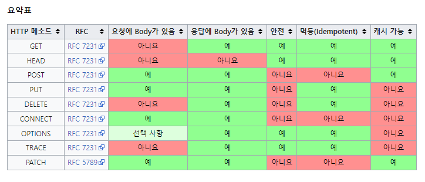

# Network 기초

## Client Server Architecture
* 리소스가 존재하는 곳(서버)과 리소스를 사용하는 앱(클라이언트)으로 분리시킨 것을 2-Tier 아키텍처, 클라이언트-서버 아키텍처라고 부른다.
* 서버는 리소스를 전달해 주는 역할만 담당하고 리소스를 저장하는 공간을 별도로 마련해 두는데, 이 공간을 데이터 베이스라고 한다. 
  * 2티어 아키텍처에 데이터베이스가 추가된 형태를 3티어 아키텍처라고 부른다.
### HTTP를 이용한 클라이언트-서버 통신과 API
* 클라이언트-서버 아키텍처에서는 서버 마음대로 클라이언트에 리소스를 전달하지 않는다.
* 웹 애플리케이션 아키텍처에서는 클라이언트와 서버가 서로 HTTP라는 프로토콜을 이용해 통신을 한다.
  * 이 때 HTTP를 이용해 주고받는 메시지는 HTTP 메시지라고 부른다.
* 같은 일을 하더라도 다양한 프로토콜이 있을 수 있다.
* 프로토콜은 각자의 프로토콜마다 지켜야 하는 규약이 있다.
  * HTTP 메시지를 확인하면 HTTP만의 규칙이 있음을 알 수 있다.

### 주요 프로토콜
#### 응용 계층 (OSI 7 Layer)

| 프로토콜      | 설명                               |
|-----------|----------------------------------|
| HTTP      | 웹에서 HTML, JSON등의 정보를 주고받는 프로토콜   |
| HTTPS     | HTTP에서 보안이 강화된 프로토콜              |
| FTP       | 파일 전송 프로토콜                       |
| SMTP      | 메일을 전송하기 위한 프로토콜                 |
| SSH       | CLI 환경의 원격 컴퓨터에 접속하기 위한 프로토콜     |
| RDP       | Windows 계열의 원격 컴퓨터에 접속하기 위한 프로토콜 |
| WebSocket | 실시간 통신, Push 등을 지원하는 프로토콜        |

#### 전송 계층(OSI 4 Layer)

| 프로토콜 | 설명                                          |
|------|---------------------------------------------|
| TCP  | HTTP, FTP통신등의 근간이 되는 인터넷 프로토콜               |
| UDP  | 단방향으로 작동하는 훨씬 더 단순하고 빠르지만, 신뢰성이 낮은 인터넷 프로토콜 |

## API(Application Programming Interface)
* 서버는 클라이언트에게 리소스를 잘 활용할 수 있도록 인터페이스를 제공해줘야 하는데, 이것을 API라고 한다. (식당에서의 메뉴판)
* API는 클라이언트가 서버에서 제공하는 리소스를 모른다고 가정했을때, 엉뚱한 리소스를 요청하지 않도록 도와준다.
* 즉, 서버가 리소스 전달을 위한 API를 구축해 놓아야 클라이언트가 이를 활용할 수 있다.
* 보통 웹에서 데이터를 요청할 때에는 HTTP라는 프로토콜을 사용하며, 주소(URL, URI)를 통해 접근할 수 있다.

## URL, URI

* 브라우저의 주소창에 입력한 URL은 서버가 제공되는 환경에 존재하는 파일의 위치를 나타낸다.
* 폴더와 파일의 위치를 찾아 이동하듯이, `/`를 이용해 서버의 폴더에 진입하거나 파일을 요청할 수 있다.
* 기본적인 보안의 일환으로 외부에서 직접 접근이 가능한 경우는 거의 없다.
### URL
* URL은 Uniform Resource Locator의 줄임말로, 네트워크 상에서 웹 페이지, 이미지, 동영상 등의 파일이 위치한 정보를 나타낸다.
* URL은 scheme, hosts, url-path로 구분할 수 있다.
* 가장 먼저 작성하는 scheme은 통신 방식(프로토콜)을 결정한다. 일반적인 웹 브라우저에서는 http(s)를 사용한다.
* hosts는 웹 서버의 이름이나 도메인, IP를 사용하며 주소를 나타낸다.
* url-path는 웹 서버에서 지정한 루트 디렉토리로부터 시작하여 웹 페이지, 이미지, 동영상 등이 위치한 경로와 파일명을 나타낸다.

### URI
* URI는 Uniform Resource Identifier의 줄임말로, 일반적으로 URL의 기본요소인 scheme, hosts, url-path에 더해 query를 포함한다.
* query는 url 뒤에 덧붙여서 추가적인 정보를 서버측에 전달하는 것이다. 클라이언트가 어떤 특정 리소스에 접근하고 싶어하는지 정보를 담는다.
* 브라우저의 검색창을 클릭하면 나타나는 주소가 URI이다.
* URI는 URL을 포함하는 상위 개념이다.

## IP, Port
### IP
* IP는 Internet Portocol의 줄임말로, 인터넷 상에서 사용하는 주소체계를 의미한다. 
#### IPv4
* 인터넷에 연결된 모든 PC는 IP 주소체계를 따라 네 덩이의 숫자로 구분된다.
* 이렇게 네 덩이의 숫자로 구분된 IP 주소체계를 IPv4 라고 한다.
* 각 덩어리마다 0부터 255까지 나타낼 수 있고, 2^32인 약 43억개의 IP주소를 표현할 수 있다.
* localhost, 127.0.0.1 : 현재 사용중인 로컬 PC를 지칭한다.
* 0.0.0.0, 255.255.255.255 : broadcast address로 로컬 네트워크에 접속된 모든 장치와 소통하는 주소이다.
  * 서버에서 접근가능 IP주소를 broadcast address로 지정하면 모든 기기에서 서버에 접근할 수 있다.

#### IPv6
* 개인 PC의 보급으로 전 세계의 누구나 PC를 이용해 인터넷에 접속할 수 있고, 서비스를 위해 서버를 생산하게 되면서 IPv4로 할당할 수 있는 PC가 한계를 넘었다.
* IPv4의 한계를 극복하기 위해 나오게 된 것이 IPv6이다.
* IPv6는 표기법을 달리 하여 2^128개의 IP주소를 표현할 수 있다.

### PORT
* IP내에서 애플리케이션 상호 구분(프로세스 구분)을 위해 사용하는 번호이다.
* 포트 숫자는 IP주소가 가리키는 PC에 접속할 수 있는 통로(채널)를 의미한다.
* 로컬 환경에서 Spring을 실행하면 Tomcat started on port(s): 8080과 같은 숫자가 나온다.
  * 8080번 통로를 통해 실행중이 라는것을 확인할 수 있다.
* 포트 번호는 0~65,535까지 사용할 수 있다.
* 0~1024까지의 포트번호는 주요 통신을 위한 규약에 따라 이미 정해져있다. (필요에 따라 자유롭게 사용할 수 있음)
* 잘 알려진 대표적인 포트번호의 예시는 다음과 같다.
  * 22 : SSH
  * 80 : HTTP
  * 443 : HTTPS

## Domain, DNS
### Domain
* 특정 사이트에 진입을 할 때, IP주소를 대신하여 사용하는 주소로, 해당 주소에 위치한 상호라 생각하면 된다.
* 도메인을 이용해서 한눈에 파악하기 힘든 IP주소를 보다 분명하게 나타낼 수 있다.
* 터미널에서 도메인 이름을 통해 IP주소를 확인하는 명령어 nslookup으로 IP주소를 확인할 수 있다.
* nslookup으로 IP주소를 확인 후 주소창에서 IP주소를 입력하면 해당 도메인으로 이동할 수 있다.
### DNS
* 네트워크 상에 존재하는 모든 PC는 IP주소가 있으나, 모든 IP주소가 도메인 이름을 갖는 것은 아니다.
* 로컬 PC를 나타내는 127.0.0.1은 localhost로 사용할 수 있지만, 그 외에 모든 도메인 이름은 일정 기간 동안 대여하여 사용한다.
* 브라우저의 검색창에 도메인 이름을 입력하여 해당 사이트로 이동하기 위해서는, 해당 도메인 이름과 매칭된 IP주소를 확인하는 작업이 필요하다.
  * 네트워크에는 이 작업을 위한 서버가 별도로 있고, 이 서버가 DNS서버이다.
* DNS(Domain Name System)은 호스트의 도메인 이름을 IP주소로 변환하거나 반대의 경우를 수행할 수 있도록 개발된 데이터베이스 시스템이다.
  * 한마디로 IP주소와 도메인을 이어주는 시스템이다.
#### DNS 처리 순서
* 브라우저에 도메인 이름을 입력한다.
* 이 요청은 DNS에서 IP주소를 찾도록 한다.
* 이 IP주소에 해당하는 웹서버로 요청을 전달하여 클라이언트와 서버가 통신할 수 있도록 한다.

## HTTP
* HTTP는 HyperText Transfer Protocol로 HTML과 같은 문서를 전송하기위한 Application Layer 프로토콜이다.
* 웹 브라우저와 웹 서버의 소통을 위해 디자인되었다.
* 클라이언트-서버 모델에서 클라이언트가 HTTP messages 양식에 맞춰 요청을 보내면, 서버도 HTTP messages양식에 맞춰 응답한다.
* HTTP는 특정 상태를 유지하지 않는 특징이 있다.(Stateless, 무상태성)
  > Stateless
  >
  > * 말 그대로 상태를 가지지 않는다는 뜻이다.
  > * HTTP로 클라이언트와 서버가 통신을 주고받는 과정에서, HTTP가 클라이언트나 서버의 상태를 확인하지 않는다.
  > * 클라이언트에서 발생한 모든 상태를 HTTP통신이 추적하지 않는다.
  > * 예시로 만약 쇼핑몰에서 담기 버튼을 누르면, 카트에 담긴 상품 상태를 저장해야 한다. 그러나 HTTP는 통신 규약일 뿐, 상태를 저장하진 않는다.
  > * 필요에 따라 쿠키-세션, API 등을 통해 상태를 확인할 수 있다.

### HTTP messages
* HTTP messages는 클라이언트와 서버 사이에서 데이터가 교환되는 방식이다.
* HTTP messages에는 요청(Requests), 응답(Responses) 두가지 유형이 있다. 
* HTTP messages는 텍스트 정보로 구성된다.
* 개발자가 이러한 메세지를 직접 작성할 필요는 거의 없고 구성파일, API, 기타 인터페이스에서 HTTP messages를 자동으로 완성한다.
#### 기본 구조
1. start line
   * start line에는 요청이나 응답의 상태를 나타낸다.
   * 항상 첫 번째 줄에 위치한다.
   * 응답에서는 status line이라고 부른다.
2. HTTP header
   * 요청을 지정하거나, 메세지에 포함되는 본문을 설명하는 헤더의 집합이다.

3. empty line
   * 헤더와 본문을 구분하는 빈 줄이다.

4. body
   * 요청과 관련된 데이터나 응답과 관련된 데이터 또는 문서를 포함한다.
   * 요청과 응답의 유형에 따라 선택적으로 사용한다.

* start line과 HTTP headers를 묶어 요청이나 응답의 head라고 한다.
* payload는 body라고 한다.
  
  > payload
  > 
  > 전송되는 데이터를 의미한다.
  > 데이터를 전송할 때 헤더와 메타 데이터, 에러 체크 비트등과 같은 다양한 요소들을 함께 보내 데이터 전송 효율과 안전성을 높이게 된다.
  > 이 때 보내고자 하는 데이터 자체를 의미하는 것이 바로 페이로드이다.

#### 요청(Requests)
##### Start line
* Start line에는 세가지 요소가 있다.
1. HTTP method를 나타낸다.
   * 수행할 작업(GET, PUT, POST등)이나 방식(HEAD or OPTIONS)을 설명한다.
   * 예로 GET method는 리소스를 받아야 하고, POST method는 데이터를 서버로 전송한다.
2. 요청 대상(보통 URL이나 URI)또는 프로토콜, 포트, 도메인의 절대 경로는 요청 컨텍스트에 작성된다.
   * 이 요청 형식은 HTTP method마다 다르다.
   * origin 형식
     * `?`와 쿼리 문자열이 붙는 절대 경로이다.
     * POST, GET, HEAD, OPTIONS등의 method와 함께 사용한다.
     * `POST / HTTP 1.1GET /background.png HTTP/1.0HEAD /test.html?query=alibaba HTTP/1.1OPTIONS /anypage.html HTTP/1.0`
   * absolute 형식
     * 완전한 URL형식으로, 프록스에 연결하는 경우 대부분 GET method와 함께 사용한다.
     * `GET <http://developer.mozilla.org/en-US/docs/Web/HTTP/Messages> HTTP/1.1`
   * authority 형식
     * 도메인 이름과 포트번호로 이루어진 URL의 authority component이다.
     * HTTP터널을 구축하는 경우 CONNECT와 함께 사용할 수 있따.
     * `CONNECT developer.mozilla.org:80 HTTP/1.1`
   * asterisk 형식
     * OPTIONS와 함께 `*` 하나로 서버 전체를 표현한다.
     * `OPTIONS * HTTP/1.1`
3. HTTP버전은 메세지의 다른 구조를 결정한다.
   * 이를 위해 HTTP버전을 함께 입력한다.
##### Header
* 요청의 Header는 기본 구조를 따른다.
* 대소문자 구분 없는 문자열과 `:`, 값을 입력한다.
* 여러 종류의 헤더가 있고, 값은 헤더에 따라 다르다.

1. Request header
   * User-Agent, Accept-Type, Accept-Language와 같은 헤더는 요청을 보다 구체화 한다.
   * Referer처럼 컨텍스트를 제공하거나 If-None과 같이 조건에 따라 제약을 추가할 수 있다.

2. General header
   * 메세지 전체에 적용된다.

3. Entity header
   * Content-Length와 같은 헤더는 body에 적용된다.
   * body가 비어있는 경우, entity header는 적송되지 않는다.

##### Body
* HTTP messages 구조의 마지막에 위치한다.
* GET, HEAD, DELETE, OPTIONS처럼 서버에 리소스를 요청하는 경우에는 본문이 필요하지 않다. (모든 요청에 body가 필요한 것은 아님)
* POST나 PUT과 같은 일부 요청은 데이터를 업데이트하기 위해 사용한다.
* body는 두 종류로 나눌 수 있다.
1. Single resource bodies(단일 리소스 본문)
   * 헤더 두개로 정의된 단일 파일로 구성된다.
2. Multiple resource bodies(다중 리소스 본문)
   * 여러 파트로 구성된 본문에서는 각 파트마다 다른 정보를 지닌다.
   * 보통 HTML form과 관련이 있다.

#### HTTP 요청 메서드
* HTTP는 요청 메서드를 정의하여 주어진 리소스에 수행하길 원하는 행동을 나타낸다.
* HTTP동사 라고 부르기도 한다.
* 클라이언트가 웹 서버에게 사용자 요청의 목적/종류를 알리는 수단이다.

##### 1) GET
* 리소스를 요청하기 위해서 사용한다.
* 리소스의 수정 없이 데이터를 받기만 한다.

##### 2) HEAD
* GET방식과 동일하지만, 실제 문서를 요청하는 것이 아니라 문서 정보를 요청하는 것이다.
* 응답에 Body가 없고 응답코드와 HEAD만 응답한다.
* 웹서버 정보확인, 헬스체크, 버전확인, 최종 수정일자 확인등의 용도로 사용된다.

##### 3) POST
* 데이터 요청을 처리하고, 메시지 바디를 통해 서버로 데이터를 전달한다.
* 예기치 못한 입력으로 서버의 상태 변화나 부작용을 일으킬 수 있다.

##### 4) PUT
* 리소스를 업데이트하기 위해서 사용한다. (UPDATE)
* 리소스가 있으면 대체하고, 리소스가 없으면 생성한다.
* POST처럼 정보를 서버로 제출하는 것이지만 덮어쓰는 것이다.

##### 5) DELETE
* 리소스를 삭제하기 위해서 사용한다. (DELETE)
* 실제로 삭제되지 않았지만 클라이언트는 삭제 되었다고 생각될 수 있다.

##### 6) OPTIONS
* 웹서버에서 지원되는 메서드의 종류를 확인할 경우 사용한다.

##### 7) CONNECT
* 프록시 기능을 요청시 사용한다.

##### 8) TRACE
* 클라이언트의 요청을 그대로 반환한다.
* 서버에 루프백 메시지를 호출하기 위해 사용한다.

##### 9) PATCH
* PUT과 유사하게 리소스를 업데이트 할 때 사용한다.
* PUT의 경우 리소스 전체를 업데이트하는 의미지만, PATCH는 해당 리소스의 일부를 교체하는 의미로 사용한다.

* 멱등성 : 메서드를 계속 호출해도 결과값이 같은지 안 같은지를 의미한다.
* 안정성 : 계속해서 메서드를 호출해도 리소스는 변경되지 않는다는 의미이다.

#### 응답(Responses)
##### status line
* 응답의 첫 줄은 status line이라고 부르며, 다음의 정보를 포함한다.

1. 현재 프로토콜의 버전(HTTP/1.1)
2. 상태 코드 : 요청의 결과를 나타낸다(200, 302, 404 등)
3. 상태 텍스트 : 상태 코드에 대한 설명

   * 예) HTTP/1.1 404 Not Found.

##### Header
* 응답에 들어가는 HTTP header는 요청 헤더와 동일한 구조를 가지고 있다.
* 대소문자 구분 없는 문자열과 `:`, 값을 입력한다.
* 값은 헤더에 따라 다르고, 요청의 헤더와 마찬가지로 몇 그룹으로 나눌 수 있다.

1. General header
   * 메시지 전체에 적용되는 헤더로, body를 통해 전송되는 데이터와는 관련이 없는 헤더이다.
2. Response header
   * 위치 또는 서버 자에체 대한 정보와 같이 응답에 대한 부가적인 정보를 갖는 헤더이다
   * vary, Accept-Ranges와 같이 상태 줄에 넣기에는 공간이 부족했던 추가정보를 제공한다.

3. Representation header
   * 이전에는 Entity header로 불렸으며, body에 담긴 리소스의 정보(콘텐츠 길이, MIME 타입 등)를 포함하는 헤더이다.

##### Body
* 응답 본문은 HTTP messages 구조의 마지막에 위치한다.
* 201, 204와 같은 상태 코드를 가지는 응답에는 본문이 필요하지 않다. (모든 응답에 body가 필요하진 않음)
* 응답의 body는 두 종류로 나눌 수 있다.
1. Single resource bodies(단일 리소스 본문)
   * 길이가 알려진 단일 리소스 본문은 두 개의 헤더(Content-Type, Content-Length)로 정의한다.
   * 길이를 모르는 단일 파일로 구성된 단일 리소스 본문은 Transfer-Encoding이 `chunked`로 설정되어 있으며, 파일은 chunk로 나뉘어 인코딩 되어 있다.
2. Multiple-resource bodies(다중 리소스 본문)
   * 서로 다른 정보를 담고 있는 body이다.

## AJAX

### AJAX란
* Asynchronous JavaScript And XMLHttpRequest의 약자로, JavaScript, DOM, Fetch, XMLHttpRequest, HTML등의 다양한 기술을 사용하는 웹 개발 기법이다.
* AJAX의 가장 큰 특징은 웹 페이지에 **필요한 부분에 필요한 데이터만 비동기적으로 받아와 화면에 그려낼 수 있다**는 것이다.
* 예) 검색창
  * 검색창에 한 글자를 입력할 때마다 해당 글자로 시작하는 단어들을 서버로부터 받아온다.
  * 그리고 그 아래 추천 검색어가 보여진다.
  * 검색창에서는 필요한 데이터만 비 동기적으로 받아와 렌더링 되며, 여기에 AJAX가 사용된다.
* 예) 무한 스크롤
  * 사용자가 목록 페이지의 맨 밑까지 스크롤하여 스크롤바 하단에 도달하면, 새로운 목록을 서버로부터 가져와 렌더링한다
  * 이렇게 무한 스크롤이 발생할 때마다 Fetch를 통해 데이터를 가져와 업데이트하고 렌더링 한다.
* AJAX는 CSR을 위해 사용한다.
### AJAX의 핵심 기술
* 기존에는 `<form>` 태그를 이용해 서버에 데이터를 전송해야 했고, 서버는 요청에 대한 응답으로 새로운 웹 페이지를 제공해 주어야 했다.
* 그러나 **Fetch를 사용**하면 페이지를 이동하지 않아도 서버로부터 필요한 데이터를 받아올 수 있다.
  * Fetch는 사용자가 현재 페이지에서 작업을 하는 동안 서버와 통신할 수 있도록 한다.
  * 브라우저는 Fetch가 서버에 요청을 보내고 응답을 받을 때까지 모든 동작을 멈추는 것이 아니라, 계속해서 페이지를 사용할 수 있게 하는 비동기적인 방식을 사용한다.

* 또한 **자바스크립트에서 DOM을 사용**해 조작할 수 있기 때문에, Fetch를 통해 전체 페이지가 아닌 필요한 데이터만 가져와 DOM에 적용시켜 새로운 페이지로 이동하지 않고 기존 페이지에서 필요한 부분만 변경할 수 있다.

### AJAX의 장점
* 서버에서 HTML을 완성하여 보내주지 않아도 웹 페이지를 만들 수 있다.
  * AJAX를 사용하면 서버에서 완성된 HTML을 보내주지 않아도 필요한 데이터를 비동기적으로 가져와 브라우저에서 화면의 일부만 업데이트하여 렌더링 할 수 있다.
* 표준화된 방법 이전에는 브라우저마다 다른 방식으로 AJAX를 사용했으나, XHR이 표준화 되면서부터 브라우저에 상관없이 AJAX를 사용할 수 있게 되었다.
* 유저 중심 애플리케이션 개발 AJAX를 사용하면 필요한 일부분만 렌더링하기 때문에 빠르고 더 많은 상호작용이 가능한 애플리케이션을 만들 수 있다.
* 이전에는 서버로부터 완성된 HTML파일을 받아와야 했기 때문에 한번에 보내야 하는 데이터의 크기가 컸다. 그러나 AJAX에서는 필요한 데이터를 텍스트형태로 보내면 되기 때문에 비교적 데이터의 크기가 작다.

### AJAX의 단점
* SEO(Search Engine Optimization)에 불리하다
  * AJAX 방식 웹 애플리케이션은 한번 받은 HTML을 렌더링 한 후 서버에서 비동기적으로 필요한 데이터를 가져와 그려낸다.
  * 따라서 처음 받는 HTML파일에는 데이터를 채우기 위한 틀만 작성되어 있는 경우가 많다
  * AJAX 방식 웹 애플리케이션의 HTML파일은 뼈대만 있고 데이터가 없기 때문에 사이트의 정보를 수집하기 어렵다.
* AJAX에서는 이전 상태를 기억하지 않기 때문에, 뒤로가기 버튼이 의도한대로 동작하지 않는다.
  * 이러한 기능을 구현하기 위해서는 별도로 History API를 사용해야 한다.

## SSR, CSR

### SSR
* SSR은 Server Side Rendering의 줄임말로, 웹페이지를 브라우저에서 렌더링 하는 대신에 서버에서 렌더링 하는 방식이다.
* 브라우저가 서버의 URI로 GET요청을 보내면, 서버는 정해진 웹페이지 파일을 브라우저로 전송한다. 그리고 서버의 웹 페이지가 브라우저에 도착하면 완전히 렌더링된다.
* 서버에서 웹페이지를 브라우저로 보내기 전에 서버에서 완전하 렌더링 했기 떄문에 Server Side Rendering이라고 한다.
* 웹 페이지의 내용에 데이터베이스의 데이터가 필요한 경우 서버는 데이터를 불러온 다음 웹 페이지를 완전히 렌더링 된 페이지로 변환한 후에 브라우저에 응답으로 보낸다.
  * 웹페이지를 보던 사용자가 다른 브라우저의 경로로 이동하면 서버는 이 작업을 다시 수행한다.

### CSR
* Client Side Rendering의 줄임말로, SSR와는 반대로 클라이언트에서 페이지를 렌더링한다.
* 브라우저의 요청을 서버로 보내면 서버는 웹 페이지를 렌더링하는 대신, 웹 페이지의 골격이 될 단일 페이지를 JavaScript 파일과 함께 클라이언트에 보낸다.
* 클라이언트가 웹페이지를 받으면 웹페이지와 함꼐 전달된 JavaScript파일은 브라우저에서 웹 페이지를 완전히 렌더링된 페이지로 바꾼다.
* 만약 웹페이지에 필요한 내용이 데이터베이스에 저장된 데이터인 경우엔, 브라우저는 데이터베이스에 저장된 데이터를 가져와서 웹 페이지에 렌더링을 해야 한다.
  * 이를 위해 API가 사용된다. 웹페이지를 렌더링하는데 필요한 데이터를 API요청으로 해결한다.
* 브라우저가 다른경로로 이동하면 SSR과 다르게 서버가 웹 페이지를 다시 보내지 않는다.
  * 브라우저가 요청한 경로에 따라 페이지를 다시 렌더링한다.
  * 이때 보이는 웹 페이지의 파일은 맨 처음 서버로부터 전달받은 웹 페이지 파일과 동일한 파일이다.

### SSR vs CSR
* SSR은 서버에서 페이지를 렌더링하고, CSR은 브라우저(클라이언트)에서 페이지를 렌더링한다.
* 브라우저는 사용자가 다른 경로를 요청할 때마다 페이지를 새로고침하지 않고 동적으로 라우팅을 관리한다.

#### SSR을 사용해야 하는 경우
* SEO가 우선순위인 경우 일반적으로 SS을 사용한다
* 웹 페이지의 첫 화면 렌더링이 빠르게 필요한 경우에도 단일 파일의 용량이 작은 SSR이 적합하다.
* 웹 페이지가 사용자와 상호작용이 적은 경우 SSR을 활용할 수 있다.

#### CSR을 사용해야 하는 경우
* SEO가 우선순위가 아닌 경우 SCR을 사용할 수 있다.
* 사이트에 풍부한 상호작용이 있는 경우 CSR은 빠른 라우팅으로 강력한 사용자 경험(UX)을 제공한다.
* 웹 애플리케이션을 제작하는 경우 CSR을 이용해 더 나은 사용자 경험(UX)을 제공할 수 있다.

## CORS
### CORS란
* Cross Origin Resource Sharing의 약자로 웹 브라우저에서 외부 도메인 서버와 통신하기 위한 방식을 표준화한 HTTP 헤더 기반 메커니즘이다.
* 클라이언트와 서버가 서로 다른 도메인일 경우가 있으므로 CORS기술이 도입되었다. (HTTP헤더의 origin이 다른 경우)
* CORS는 웹 브라우저가 만들고 실행하는 도메인이 달라도 리소스에 액세스할 수 있도록 하는 보안 메커니즘이다.
* 서버쪽에서 클라이언트를 대상으로 리소스의 허용 여부를 결정하는 방법이다.
* 같은 origin에서 AJAX를 시도하면 CORS문제가 발생하지 않는다.
* 클라이언트는 서버가 어떤 origin 요청을 허용하는지는 알 수 없다.
* 클아이언트에서 요청을 보낸 후 서버로부터 받은 Access Control Allow Origin헤더 속성을 통해서 접속 가능 여부를 확인한다.
* SOP(Same origin Policy)를 열어주기 위해

### CORS가 만들어진 이유
* 이전에는 리소스를 저장하는 서버와 웹 페이지가 하나의 서버에서 만들어졌다.
* 그러나 시간이 지나 웹 기술이 발전하였고, 페이지와 리소스를 분리하거나 다른 서버의 리소스를 요청해야 하는 상황이 많이 생겼다.
* 개발자들은 편법을 이용해 다른 서버의 리소스를 가져다 썼으며, 이러한 편법을 쓰기보다는 공식적으로 외부 도메인 리소스를 가져다 쓰라고 만들어진 것이 CORS다.
* CORS는 요청을 받은 웹서버가 허용할 경우에는 다른 도메인에서도 리소스를 주고 받을 수 있게 해준다.

### Preflight Request
* 클라이언트에서 요청하려는 URL이 외부 도메인일 경우, 웹브라우저에서 자체적으로 실행된다.
* 브라우저에서는 실제로 요청하려는 경로와 같은 URL에 대해 서버에 OPTIONS 메서드로 사전 요청을 보내고 요청을 할 수 있는 권한이 있는지 확인한다.
* 실질적인 클라이언트 요청 전 OPTIONS 메서드를 통해 발생한다.
* 실제 요청이 유효한지 서버가 미리 파악할 수 있도록 하는 수단이다.
* 모든 cross origin 요청이 Preflight Request를 발생시키는 것은 아니다.
* cross origin 요청에는 Simple requests, Prelfighted requests, Requests with credentials 등이 있는데 이 중 Preflighted requests만 OPTIONS메서드를 통해 요청한다.

### 브라우저가 origin이 다르다고 판단하는 경우
* origin을 구분하는 기준은 프로토콜, 호스트(도메인), 포트 번호 이다.

### CORS 처리 방법
#### 모든 외부 도메인에서 모든 요청을 할 경우
* 웹 브라우저의 스크립트 엔진에서 Preflight 요청 응답으로 Access Control Allow Origin 헤더의 값이 `*`이면 모든 도메인에서 요청을 허용한다는 것으로 판단한다.
* AJAX 요청이 실패하면 발생하는 메세지는 바로 Preflight 요청을 날린 응답 메세지에 Access Control Allow Origin헤더가 없어서 요청이 허용되지 않는다는 뜻이다.

#### 외부 도메인 요청을 선별적으로 허용할 경우
* 브라우저는 CORS 스펙과 관련된 header의 규격을 확인한다.
* Request headers
  * Origin : 요청을 보내는 페이지의 출처 (도메인)
  * Access Content Request Method : 실제 요청하려는 메서드
  * Access Content Request Headers : 실제 요청에 포함되어 있는 헤더 이름
* Response headers
  * Access Control Allow Origin : 요청을 하용하는 출처 (특정하려면 프로토콜 + 호스트 + 포트번호 입력)
  * Access Control Allow Credentials : 클라이언트 요청이 쿠키를 통해서 자격을 정명하는 경우에 true이고, true를 으답받은 클라이언트는 실제 요청 시 서버에서 정의된 규격의 인즉값이 담긴 쿠키를 같이 보내야 한다.
  * Access Control Expose Headers : 클라이언트 요청에 포함되어도 되는 사용자 정의 헤더이다.
  * Access Control Max Age : 클라이언트에서 Prefligth의 요청 결과를 저장할 기간을 지정하며, 클라이언트에서 Prefligth요청의 결과를 저장하고 있을 시간이다. 해당 시간동안은 Preflight요청알 다시 하지 않게 된다.
  * Access Control Allow Methods : 요청을 허용하는 메서드로, 기본값은 GET, POST이다. 이 헤더가 없으면 GET과 POST요청만 가능하며, 만약 헤더가 지정되어 있으면 클라이언트는 헤더 값에 해당하는 메서드일 경우에만 실제 요청을 시도한다.
  * Access COntrol Allow Headers : 요청을 허용하는 헤더이다

## REST
### REST란?
* REST는 Representational State Transfer의 약자로, 말 그대로 리소스의 표현에 의한 상태 전달이다.
  * 리소스의 표현 : 그 리소스를 표현하기 위한 이름
  * 상태 전달 : 데이터가 요청되어 지는 시점에서 리소스의 상태를 전달한다. (보통 JSON, XML을 통해 데이터를 주고받음)
* www(World Wide Web)과 같은 분산 하이퍼미디어 시스템을 위한 소프트웨어 아키텍처의 한 형식이다.
  * 기본적으로 웹의 기존 기술과 HTTP프로토콜을 그대로 활용하기 때문에 웹의 장점을 최대한 활용할 수 있는 아키텍처 스타일이다.
### REST의 개념
* HTTP URL을 통해 리소스를 명시하고, HTTP Method를 통해 해당 리소스에 대한 CRUD를 적용하는 것을 의미한다.
* 자원 기반의 구조 (ROA, Resource Oriented Architecture) 설계의 중심에 리소스가 있고, HTTP Methode를 통해 리소스를 처리하도록 설계된 아키텍처이다.
* 웹 사이트의 이미지, 텍스트, DB 등의 모든 리소스에 고유한 ID인 HTTP URL을 부여한다.

### REST 구성 요소
1. 자원(Resource) : URL
    * 모든 리소스에 고유한 ID가 존재하고, 이 리소스는 서버에 존재한다.
    * 리소스를 구별하는 ID는 HTTP URL이다.
    * 클라이언트는 URL을 이용해 리소스를 지정하고 해당 리소스의 상태에 대한 조작을 서버에 요청한다.

2. 행위(Verb) : HTTP Method
    * HTTP 프로토콜의 메서드를 사용한다
    * HTTP 프로토콜은 GET, POST, PUT, DELETE와 같은 메서드를 제공한다.

3. 표현(Representation)
    * 클라이언트가 리소스의 상태에 대한 조작을 요청하면, 서버는 이에 적절한 응답을 보낸다
    * REST에서 하나의 리소스는 JSON, XML등 여러 형태의 응답으로 나타내질 수 있다.

### REST의 특징
1. Server-Client(서버-클라이언트 구조)
    * 서버-클라이언트 구조를 가진다.

2. 무상태(Stateless)
    * HTTP는 Stateless 프로토콜 이므로 REST 역시 Stateless를 갖는다.
    * 클라이언트의 컨텍스트를 서버에 저장하지 않는다.

3. 캐시 처리 가능(Cacheable)
    * 웹표준 HTTP프로토콜을 그대로 사용하므로, 웹에서 사용하는 기존의 인프라를 그대로 활용 가능하다.

4. 계층화
    * API서버는 순수 비즈니스 로직을 수행하고, 그 앞단에 사용자 인증, 암호화, 로드밸런싱 등을 하는 계층을 추가하여 구조상의 유연성을 줄 수 있다.

5. 인터페이스 일관성(Uniform Interface)
    * URI로 지정한 자원에 대한 조작을 통일되고 한정적인 인터페이스로 수행한다.
    * HTTP표준에만 따른다면 모든 플랫폼에서 사용이 가능하다.

6. 자체 표현 구조
    * 메서드와 URI로 이루어져 있으며, 어떤 메서드에 무슨 행위를 하는지 알 수 있다.
    * REST API자체가 간단하기 때문에 API 메시지 자체만 보고도 API를 이해할 수 있다.

### REST의 장점
* HTTP 프로토콜의 인프라를 그대로 사용하므로 위한 별도의 인프라를 구출할 필요가 없다. (쉽게 사용 가능)
* HTTP 표준 프로토콜을 따르는 모든 플랫폼에서 사용이 가능하다.
* REST API 메시지가 의도하는 바를 명확하게 나타내므로 의도하는 바를 쉽게 파악할 수 있다.
* 서버와 클라이언트의 역할이 명확하게 분리된다.
  * 클라이언트는 REST API를 통해 서버와 정보를 주고받는다.
  * REST의 특징인 Stateless에 따라 서버는 클라이언트의 Context를 유지할 필요가 없다.
* 특정 데이터 표현을 사용할 수 있다.
  * REST API는 헤더 부분에 URI 처리 메서드를 명시하고, 필요한 실제 데이터를 Body에 표현할 수 있도록 분리시켰다.
  * JSON, XML등 원하는 표현 언어로 사용 가능하다.

### REST의 단점
* REST는 설계 가이드일 뿐이므로, 명확한 표준이 존재하지 않는다.
* REST는 HTTP메서드를 이용하여 URI를 표현하므, 간단하게 사용할 수 있다는 장점도 있지만, 반대로 사용할 수 있는 메소드가 제한적이다.

### REST API란
* API란 클라이언트가 리소스를 요청할 수 있도록 서버측에서 제공된 인터페이스를 말한다.
* REST API는 REST기반으로 서비스 API를 구현하는 것을 의미한다.
* 최근에 OpenAPI(구글맵, 공공데이터 등), 마이크로 서비스등을 제공하는 업체 대부분은 이 REST API를 제공한다.

___
참고

https://developer.mozilla.org/ko/docs/Web/HTTP/Methods

https://ko.wikipedia.org/wiki/HTTP

https://hanamon.kr/%eb%84%a4%ed%8a%b8%ec%9b%8c%ed%81%ac-http-options-%eb%a9%94%ec%86%8c%eb%93%9c%eb%a5%bc-%ec%93%b0%eb%8a%94-%ec%9d%b4%ec%9c%a0%ec%99%80-cors%eb%9e%80/

https://usefultoknow.tistory.com/entry/REST%EB%9E%80-%EB%AC%B4%EC%97%87%EC%9D%BC%EA%B9%8C

코드스테이츠 교육