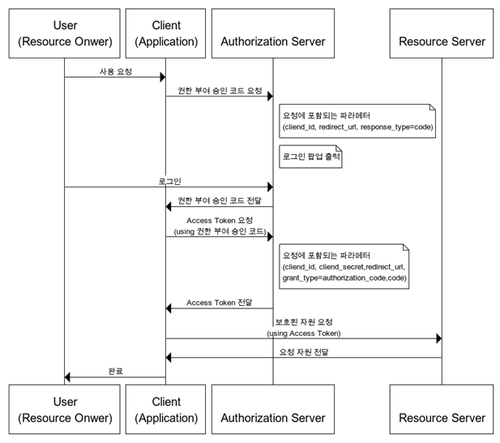
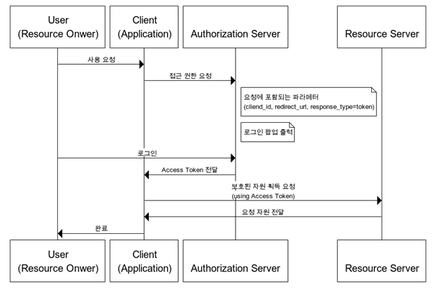
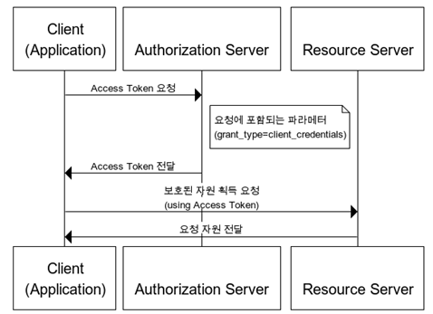
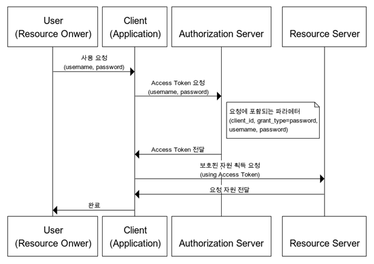

# OAuth2
## OAuth2?
* OAuth2는 인증을 위한 표준 프로토콜의 한 종류이다. (google과 같이 특정 소셜네트워크등에서 제공하는 기술이 아님)
* 보안된 자원에 접근하기 위해 클라이언트에게 권한을 제공하는 프로세스를 단순화하는 프로토콜이다.

## OAuth2 용어 정리
* OAuth2를 공부하면서 나오는 용어가 헷갈릴 수 있으니 용어를 한번 정리 하고 가는게 좋다.
### Resource Owner
* 액세스 중인 리소스의 유저이다. 
* 예시로, 홍길동이라는 사람이 구글 계정을 이용하여 소셜로그인할 경우, 이때 리소스 오너는 홍길동이 된다.

### Client 
* 리소스 오너를 대신하여 보호된 리소스에 액세스하는 애플리케이션이다.
* 클라이언트는 서버, 데스크탑, 모바일 또는 기타 장치에서 호스팅할 수 있다.
* 예시로, 홍길동이라는 사람이 A라는 애플리케이션을 구글 계정을 이용하여 소셜로그인할 경우 A가 클라이언트가 된다.

### Resource Server
* 클라이언트의 요청을 수락하고 응답해주는 서버이다.
* 예시로, A 애플리케이션이 Google Photo에서 홍길동의 사진을 가져오는 경우, Google Photo가 리소스 서버가 된다.

### Authorization Server
* 리소스 오너를 성공적으로 인증한 후 클라이언트에게 액세스 토큰을 발급해주는 서버를 말한다.
* 리소스 서버가 액세스 토큰을 발급받는 인증 서버이다.

### Authorization Grant
* 클라이언트가 액세스 토큰을 얻는 방법을 말한다.
* 다음과 같은 방법들이 주로 사용된다.
  * Authorization Code Grant Type : Authorization Code를 활용하여 엑세스 토큰을 받는 방식으로, 가장 많이 사용된다.
  * Implicit Grant Type
  * Client Credentials Grant Type
  * Resource Owner Credentials Grant Type
### Authorization Code
* Authorization Grant의 한 타입으로 액세스 토큰을 발급받기 위한 Code를 의미한다.
* Client ID로 이 Code를 받아온 후, Client Secret과 Code를 이용해 액세스 토큰을 받아올 수 있다.
### Access Token
* 보호된 리소스에 액세스하는 데 사용되는 인증 토큰이다. 
* Authorization Code를 이용해 받아온 이 액세스 토큰으로 리소스 서버에 접근할 수 있다.
### Scope
* Scope는 토큰의 권한을 정의하며, 주어진 액세스 토큰을 사용하여 액세스할 수 있는 리소스의 범위이다.
* 이와 같은 설정을 통해 특정 리소스에는 접근할 수 있지만, 다른 리소스에는 접근할 수 없도록 접근 권한을 지정할 수 있다.

## OAuth2 승인 방식에 따른 동작 과정
* OAuth2 프로토콜에서는 다양한 클라이언트 환경에 적합하도록 권한 부여 방식에 따른 프로토콜을 4가지 종류로 구분하여 제공한다.
* 각 권한부여 방식에 따라 동작 과정이 조금씩 다르다.
### Authorization Code Grant Type
* 자체 생성한 Authorization Code를 전달하는 방식이다.
* 간편 로그인 기능에서 사용되는 방식으로, 클라이언트가 리소스 오너를 대신하여 특정 자원에 접근을 요청할 때 사용되는 방식이다.
* 가장 많이 쓰이는 기본이 되는 방식이며, 리프레시 토큰을 사용할 수 있다.

1. 리소스 오너가 소셜로그인 버튼을 누르는 등의 요청을 보낸다.
2. 클라이언트가 client_id, redirect_uri, response_type=code등을 인증 서버에 전달하며 Authorization Code를 요청한다.
    * 응답 타입은 code, token등을 사용할 수 있는데, 만약 응답 타입이 token일 경우 ImplicitGrant Type이 된다.
3. 리소스 오너가 로그인하여 정상적으로 인증 되면 Authorization Code를 클라이언트에게 보낸다.(redirect uri로 전달)
4. Authorization Code를 받은 클라이언트는 Authorization Code를 이용하여 액세스 토큰을 Authorization Server에 요청한다.
    * 이때도 client_id, redirect_uri, response_type등을 보낸다.
5. 클라이언트는 발급받은 액세스토큰을 사용하여 리소스서버에 리소스를 요청한다.
6. 리소스 서버는 액세스 토큰을 확인한 후 요청받은 리소스를 전달한다.

### Implicit Grant Type
* Authorization Code 없이 바로 액세스토큰을 발급하는 방식이다.
* 자격 증명을 안전하게 저장하기 힘든 클라이언트(스크립트 언어를 사용한 브라우저)에게 최적화된 방식이며, 리프레스 토큰 사용이 불가능하다.

1. 리소스 오너가 소셜로그인 버튼을 누르는 등의 요청을 보낸다.
2. 클라이언트가 client_id, redirect_uri, response_type=token 등을 인증서버에 전달하며 접근 권한 요청을 한다.
3. 리소스 오너가 정상적으로 인증되면 인증서버는 클라이언트에게 액세스토큰을 전달한다. (redirect uri로 전달)
4. 클라이언트는 발급받은 액세스토큰을 사용하여 리소스서버에 리소스를 요청한다.
5. 리소스 서버는 액세스 토큰을 확인한 후 요청받은 리소스를 전달한다.

### Client Credentials Grant Type
* OAuth2의 권한 부여 방식중 가장 간단한 방식이다.
* 클라이언트가 관리하는 리소스나 인증서버에 해당 클라이언트를 위한 제한된 리소스 접근 권한이 설정되어 있는 경우 사용가능하다.
* 자격 증명을 안전하게 보관할 수 있는 클라이언트에서만 사용되어야 하며, 리프레시 토큰의 사용은 불가능하다.

1. 클라이언트가 grant_type=client_credentials등을 인증서버에 전달하며 액세스 토큰을 요청한다. 
2. 클라이언트가 정상적으로 인증되면 인증서버는 액세스토큰을 전달한다.
3. 클라이언트는 발급받은 액세스토큰을 사용하여 리소스서버에 리소스를 요청한다.
4. 클라이언트는 액세스 토큰을 확인한 후 요청받은 리소스를 클라이언트에 전달한다.

### Client Owner Password Credentials Grant Type
* 간단하게 로그인 시 필요한 정보로 액세스 토큰을 발급받는 방식이다.
* 자신의 서비스에서 제공하는 애플리케이션의 경우에만 사용되는 인증방식이며, 리프레시 토큰을 사용할 수 있다.
* 예시로 네이버 계정으로 네이버 웹툰 애플리케이션에 로그인 하는 경우이다. (인증서버, 리소스서버, 클라이언트가 모두 같은 시스템에 속해있을 경우)

1. 리소스 오너가 클라이언트에게 username, password 등을 전달하며 요청을 한다.
2. 클라이언트에서는 리소스 오너에게 전달받은 정보를 통해 인증서버에 액세스토큰을 요청한다.
3. 인증에 성공하면 인증서버는 클라이언트에게 액세스 토큰을 전달한다.
4. 클라이언트는 액세스 토큰을 이용하여 리소스 서버에 리소스를 요청한다.
5. 리소스 서버는 액세스 토큰을 확인한 후 요청받은 리소스를 클라이언트에 전달한다.

___
참고

사진 출처 : https://blog.naver.com/mds_datasecurity/222182943542
 
codestates 교육자료
