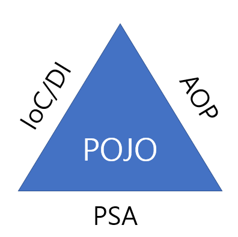

# SpringBasic
## Spring Framework이란
### Framework?
* 프로그래밍 상에서 Framework은 기본적으로 프로그래밍을 하기 위한 어떠한 틀이나 구조를 제공한다.
* Framework은 개발자가 애플리케이션의 핵심 로직을 개발하는 것에 집중할 수 있도록 해준다.
* Library와의 차이점은, Library는 애플리케이션 흐름의 주도권이 개발자에게 있고, Framework은 애플리케이션의 흐름의 주도권이 개발자가 아닌 Framework에 있다.

### Spring Framework?
* Spring Framework은 Java기반의 웹 애플리케이션을 개발하는데 필요한 Framework이며, 그냥 Spring이라고도 많이 부른다.
* Spring의 핵심 컨셉은 **좋은 객체 지향** 애플리케이션을 개발할 수 있게 도와주는 Framework이다.
* Java기반의 웹 애플리케이션을 개발하는데 있어선 거의 표준과 다름없다.
* Spring이 도입되기 전에는 JSP나 Servlet을 사용한 Model1, Model2아키텍쳐를 기반으로한 Java웹 애플리케이션을 제작했다.
* Spring MVC 방식이 도입됨으로써 Java 웹 애플리케이션의 제작 방식이 획기적으로 변하게 되었고, Spring MVC 설정의 복잡함과 어려움을 극복하기위해 Spring Boot라는게 탄생하게 된다.
* Servlet 자체를 사용하는 기술은 현재 거의 사용하고 있진 않지만, Spring MVC같은 웹 애플리케이션 내부에서 여전히 사용되고 있다.
  * 아파치 톰캣(Apache Tomcat)은 Servlet Container의 한 종류로, Spirng MVC기반의 웹 애플리케이션은 기본적으로 아파치 톰캣에서 실행된다.

## 객체 지향 프로그래밍
* 객체 지향 프로그래밍의 특징에는 추상화, 캡슐화, 상속, **다형성**이 있다.
* 객체 지향 프로그래밍은 여러개의 독립된 단위인 객체들의 모임으로 프로그램을 구성하는 것이고, 각각의 객체는 메세지를 주고받거나 데이터를 처리할 수 있다.
* 이러한 객체 지향 프로그래밍은 프로그램을 유연하고 변경에 용이하게 만들기 때문에 대규모 소프트웨어 개발에 많이 사용된다.
* 객체 지향 프로그래밍의 특징 중 **다형성이 가장 핵심**이라고 할 수 있다.
  * 다형성으로 인터페이스를 구현한 객체를, 실행 시점에 유연하게 변경할 수 있다.
  * 이러한 다형성을 이용하면 개발 시 클라이언트를 변경하지 않고 서버의 구현기능을 유연하게 변경할 수 있게 된다.
  * 스프링에선 IoC, DI를 통해 이 다형성을 극대화해서 이용할 수 있도록 도와준다.
* 객체 지향의 핵심은 다형성 이지만, 다형성만으로는 쉽게 부품을 갈아끼우는 것과 같은 좋은 객체 지향 적인 개발을 할 수 없다.
  * 다형성만으로는 SOLID의 OCP, DIP를 지킬수 없고, 스프링에선 DI 컨테이너와 DI를 통해 이 문제를 해결할 수 있다.

### SOLID
#### 단일 책임 원칙 (SRP, single responsibility principle)
* 한 클래스는 하나의 책임만 가져야 한다.
* 만약 변경이 있을 때, 파급 효과가 적으면 단일책임 원칙을 잘 따른 것이다.
* ex) 객체의 생성과 사용을 분리
#### 개방-폐쇄 원칙 (OCP, Open/closed principle)
* 확장에는 열려있으나 변경에는 닫혀있어야 한다.
* 인터페이스를 구현한 새로운 클래스를 만들어서 새로운 기능을 구현하며 확장한다. (다형성 활용)
* 그러나 다형성만으론 OCP를 지킬 수 없다.
#### 리스코프 치환 원칙 (LSP, Liskov substitution principle)
* 객체는 프로그램의 정확성을 깨뜨리지 않으면서 하위타입의 인스턴스로 바꿀 수 있어야 한다.
* 다형성에서 하위 클래스는 인터페이스의 규약을 모두 지켜야 한다.
  * 다형성을 지원하기 위한 원칙, 인터페이스를 구현한 구현체를 믿고 사용하려면 이 원칙이 필요하다.
* 단순히 컴파일에 성공해 동작하는 것을 넘어서는 부분이다. (약속한 대로 동작이 되야 한다.)
* ex) 자동차의 액셀 기능은 느리더라도 앞으로 가야된다. 뒤로 가게 구현되면 LSP 위반

#### 인터페이스 분리 원칙 (ISP, Interface segregation principle)
* 인터페이스를 기능에 맞게 적당히 잘 분리해야 한다.
* 이로인해 인터페이스가 명확해지고, 대체 가능성이 높아진다
#### 의존관계 역전 원칙 (DIP, Dependency inversion principle)
* 추상화에 의존해야 하며, 구체화에 의존하면 안된다.
* 즉 구현 클래스에 의존하지 말고 인터페이스에 의존해야 한다는 뜻이다.
* 인터페이스에 의존해야 유연하게 구현체를 변경할 수 있다. (구현체에 의존하게 되면 변경이 어려워짐)

## Spring의 핵심 개념

* 위 그림은 Spring 삼각형이라는 유명한 그림이다.
* 이 삼각형 하나로 Spring의 핵심 개념들을 모두 표현하고 있다고 봐도 된다.
* 그림에서 POJO는 Spring에서 사용하는 핵심 개념들에 둘러 싸여져 있는 모습인데, POJO라는 것을 IoC/DI, AOP, PSA를 통해서 달성할 수 있다는 것을 의미한다.
### POJO
* POJO는 Plain Old Java Object의 약자로, 말그대로 해석하면 오래된 방식의 간단한 자바 오브젝트라는 말이다.
  * 풀어서 얘기하면, Java 객체가 다른 기술이나 환경에 종속되지 않는다는 것을 의미한다.

1. Java나 Java의 스펙에 정의된 것 이외에는 다른 기술이나 규약에 얽매이지 않아야 한다.
    * 특정 기술을 상속해서 코드를 작성하게 되면 나중에 다른 기술로 변경하려면 코드를 일일이 전부 수정해야 하는 일이 생긴다.
    * 또한 Java는 다중상속을 지원하지 않기 때문에 한번 상속을 하게되면, 하위클래스를 확장하는 객체지향 설계기법을 적용하기 어려워진다.

2. 특정 환경에 종속적이지 않아야 한다.
    * 예를들면 아파치 톰캣이라는 서블릿 컨테이너를 이용하다가, 톰캣 말고 제티라는 다른 서블릿 컨테이너를 사용하게 되는 상황이 오면 톰캣 API코드를 제티로 수정하거나 최악의 경우에는 애플리케이션을 전부 고쳐야 하는 상황이 올 수도 있다. 
3. Spring에서는 POJO 프로그래밍을 지향하기 위해 IoC/DI, AOP, PSA라는 기술을 제공한다.
#### POJO 프로그래밍이 필요한 이유
* 특정환경이나 기술에 종속적이지 않으면 재사용 가능하고, 확장에 유연한 코드를 작성할 수 있다.
* 저수준 레벨의 기술과 환경에 종속적인 코드를 애플리케이션 코드에서 제거함으로써 코드가 간결해진다.
* 코드가 간결해지기 때문에 디버깅하기가 상대적으로 쉽다.
* 특정 기술이나 환경에 종속적이지 않기 때문에 테스트가 단순해진다.
* **객체지향적인 설계를 제한없이 적용할 수 있다.**

### Ioc/DI
* IoC란 Inversion of Control의 약자로, 애플리케이션 흐름의 주도권이 개발자에게 있지 않고 Framework이나 서블릿 컨테이너 등 외부에 있는 것으로 흐름의 주도권이 뒤바뀐 것을 Ioc라고 한다.
* DI란 Dependency Injection의 약자로, Ioc는 서버 컨테이너 기술, 디자인 패턴, 객체 지향 설계 등에 적용하게되는 일반적인 개념인데, DI는 IoC개념을 조금 더 구체화 시킨 것으로, **객체 간의 관계를 느슨하게 해준다.**
* 객체지향 프로그래밍에서 의존성이라고 하면 대부분 객체 간의 의존성을 의미한다.
* 의존성 주입이란 생성자를 통해서 어떤 클래스의 객체를 전달 받는것이라고 생각하면 된다.
* 생성자의 파라미터로 객체를 전달하는 것을 외부에서 객체를 주입한다라고 표현한다.
* 클래스 내부에서 new를 사용해 참조할 클래스의 객체를 직접 생성하지 않고, 생성자등을 통해 다른 클래스의 객체를 전달받고 있으면 의존성 주입이 이루어 지고 있는 것이다.
* new 키워드를 사용하여 객체를 생성할 때, 클래스 간에 강하게 결합되어 있다고 한다.
* 클래스가 인터페이스같이 일반화된 구성 요소에 의존하고 있을 때, 클래스들 간에 느슨하게 결합되어 있다고 한다.
* 객체들간의 느슨한 결합은 요구사항의 변경에 유연하게 대처할 수 있도록 해준다.
* Spring을 사용하면, 애플리케이션 코드에서 이루어지는 DI를 Spring에서 대신 해준다.

### AOP
* Aspect Oriented Programming의 약자로, 관심 지향 프로그래밍이라고 한다.
* AOP에서 Aspect는 애플리케이션의 공통 관심사를 의미한다.
* 애플리케이션의 공통 관심사는 비즈니스 로직을 제외한 애플리케이션 전반에 걸쳐서 사용되는 공통 기능들을 의미한다.
  * 예로는 로깅, 보안, 트랜잭션, 모니터링, 트레이싱 등의 기능이 있다.
* 중복된 코드를 공통화해서 재사용 가능하도록 만들어야 하고, 이 공통화 작업은 AOP를 통해서 할 수 있다.
* AOP를 활용하면 공통 기능들을 비즈니스 로직에서 깔끔하게 분리하여 재사용 가능한 모듈로 사용할 수 있게 된다.
#### AOP의 장점
* 코드의 간결성 유지
* 객체 지향 설계 원칙에 맞는 코드 구현
* 코드의 재사용

### PSA
* Portable Service Abstraction의 약자로, 직역하면 일관된 서비스 추상화라고 해석할 수 있다.
* 추상화 된 상위 클래스를 일관되게 바라보며 하위클래스의 기능을 사용하는 것이 PSA의 기본 개념이다.
* 애플리케이션에서 특정 서비스를 이용할 때, 서비스의 기능을 접근하는 방식 자체를 일관되게 유지하면서 기술 자체를 유연하게 상요할 수 있도록 하는것을 PSA라고 한다.
* PSA가 필요한 주된 이유는, 어떤 서비스를 이용하기 위한 접근 방식을 일관된 방식으로 유지함으로써 애플리케이션에서 사용하는 기술이 변경되더라도 최소한의 변경으로 변경된 요구사항을 반영할 수 있게 하기 위해서이다.

## 아키텍처
* 아키텍처(Architecture)는 건축 분야에서 유래된 용어로써, 요구 사항을 만족하는 건축물을 짓는데 있어 청사진 같은 역할을 한다.
* 소프트웨어의 구성을 큰 그림으로 표현한 것이 소프트웨어 아키텍처이다.
* 애플리케이션은 소프트웨어 종류의 하나로, 좁게는 데스크탑이나 스마트폰에서 사용하는 응용 프로그램을 말하지만, 넓게는 클라이언트의 요청을 처리하는 서버 애플리케이션을 의미한다.
* 웹 개발을 목표로 하기 떄문에, 중점적으로 알아야 할 아키텍처는 웹 상에서 동작하는 웹 애플리케이션을 위한 아키텍처이다.

### 계층형 애플리케이션 아키텍처
* REST API 기반 웹 애플리케이션의 계층은 크게 API계층, 비즈니스 계층, 데이터 액세스 계층으로 구분된다.
* API 계층은 클라이언트의 요청을 받아들이는 계층이다.
* 비즈니스 계층은 API 계층에서 전달받은 요청을 업무 도메인의 요구사항에 맞게 비즈니스적으로 처리하는 계층이다.
* 데이터 액세스 계층은 비즈니스 계층에서 처리된 데이터를 데이터베이스 등의 데이터 저장소에 저장하기 위한 계층이다.

### Spring Module의 아키텍처

* 위 사진은 Spring Framework에서 지원하는 모듈들을 아키텍처로 표현한 그림이다.
* 지금은 각 모듈들이 눈에 잘 들어오지 않지만, 추후 Spring을 더 공부하고 나서 다시 보면 눈에 많이 익숙해져 있을 것이다.

>모듈
> 
> * Java에서는 보통 지원되는 여러가지 기능들을 목적에 맞게 그룹화하여 묶어 놓은 것을 모듈이라고 한다.
> * 모듈들은 Java의 패키지 단위로 묶여 있으며, 이 패키지 안에는 고나련 기능을 제공하기 위한 클래스들이 포함되어 있다.
> * 일반적으로 모듈은 재사용 가능하도록 라이브러리 형태로 제공되는 경우가 많다.

## Spring Boot
* Spring Framework의 편리함에도 불구하고 Spring 설정의 복잡함으로 인해 Spring 기반 애플리케이션 개발을 시작하기도 전에 어려움을 겪는 경우가 많다.
* Spring Boot은 이를 해결하기 위해 생겨난 Spring Project중 하나이다.
* Spring의 구성은 Spring Boot에서 해주기 때문에, 비즈니스 로직에 집중할 수 있게 된다.
### Spring Boot을 사용해야 하는 이유
#### XML기반의 복잡한 설계 방식 지양
* Spring Boot 이 전에는 Spring 애플리케이션 개발을 위한 설정은 굉장히 복잡했다.
* 하지만 Spring Boot으로 인해 개발자는 Spring의 복잡한 설정에 대한 어려움으로 부터 벗어날 수 있게 되었다.
#### 의존 라이브러리의 자동 관리
* Spring Boot 이 전에는 애플리케이션에서 필요한 라이브러리를 사용하기 위해서는 필요한 라이브러리들의 이름과 버전을 일일이 추가해야 했다.
* 이로인해 라이브러리 간의 버전 불일치로 인한 빌드 오류 및 실행 오류가 굉장히 많았다.
* Spring Boot의 starter 모듈 구성 기능을 통해 의존 라이브러리를 수동으로 설정해야 하는 불편함이 사라졌다.
#### 애플리케이션 설정의 자동 구성
* Spring Boot은 starter 모듈을 통해 설치되는 의존 라이브러리를 기반으로 애플리케이션의 설정을 자동으로 구성한다.
* 자동으로 구성해주기 때문에 애플리케이션에 대한 설정을 직접해야 하는 번거로움이 줄었다.
#### 프로덕션 급 애플리케이션의 손쉬운 빌드
* Spring Boot을 사용하면 개발한 애플리케이션 구현 코드를 손쉽게 빌드하며, 빌드 결과물을 War(Web application archive)파일 형태로 WAS(Web Application Server)에 올릴 필요가 없다.
* Spring Boot에서 빌드를 하면 jar파일이 생성되고, jar파일은 즉시 시작 가능한 애플리케이션 실행파일로 사용된다.
> WAS
> 
> * Java 기반의 웹 애플리케이션을 배포하는 일반적인 방식은, 개발자가 구현한 애플리케이션 코드를 war파일 형태로 빌드한 후에 WAS라는 서버(Java에서는 서블릿 컨테이너)에 배포해서 해당 애플리케이션을 실행하는 것이다.
> * 대표적인 WAS로는 Tomcat이 있다.
> * WAS는 구현된 코드를 빌드해서 나온 결과물을 실제 웹 애플리케이션으로 실행되게 해주는 서버이다.
>

#### 내장된 WAS를 통한 손쉬운 배포
* Spring Boot는 Apache Tomcat이라는 WAS를 내장하고 있기 떄문에 별도의 WAS를 구축할 필요가 없다.
* Spring Boot을 통해 빌드된 jar파일을 이용해서 명령어 한줄로 서비스 가능한 웹 애플리케이션을 실행할 수 있다.

## Spring project 생성
### project 생성
* 스프링 부트는 스프링을 쉽게 사용할 수 있도록 필요한 설정들이 모두 세팅되어져 있는 것을 말한다. 
* 스프링 부트 스타터 사이트인 https://start.spring.io 에서 프로젝트를 생성한다.
* Project에는 Maven Project와 Gradle Project가 있는데, 과거 프로젝트들은 Maven으로 남아있는게 있으나, **요즘은 Gradle을 이용**하는 추세이다.
* Project Metadata에 Group에는 보통 기업 도메인명을 적고, Artifact는 빌드되어 나오는 결과물을 말한다. (프로젝트 명)
* Dependencies란에선 어떤 라이브러리를 쓸 건지 결정하면 된다.
    * 웹 프로젝트를 만들 것이므로, Spring Web 선택
    * html을 만들어주는 템플릿 엔진으로 Thymeleaf를 선택
* generate를 클릭하면 zip파일이 다운되는데, 압출을 풀고 해당 파일을 IntelliJ로 실행하면 준비 완료이다.

### .gitignore 파일
* git에는 소스코드만 올라갈 수 있도록 스프링 부트에서 자동적으로 생성해준다.

### gradle 폴더
* gradle wrapper와 같이 gradle과 관련된 파일들이 있다.
>gradle
>
> groovy를 이용한 빌드 자동화 시스템이다. 소프트웨어 개발자가 반복적으로 해야하는 코딩을 잘 짜여진 프로세스를 통해 자동으로 실행하며 믿을 수 있는 결과물로 생산해 낼 수 있는 방법이다.
> 1) 빠른 기간동안 계속해서 늘어나는 라이브러리를 추가한다.
> 2) 프로젝트를 진행하면서 라이브러리의 버전을 쉽게 동기화할 수 있다.
### src 폴더
* src에 main과 test가 있는데, main에는 JAVA와 resources가 있다.
  * JAVA에 실제 패키지들과 소스파일들이 있다
  * resources에는 xml, html, properties 등이 들어간다.
  * test에는 test코드들과 관련된 소스들이 들어가 있다. (test code가 요즘 개발 트렌드에서 매우 중요하다)
* gradle과 관련되서 gradle을 쓰는 폴더가 있다.

### build.gradle 파일
* 스프링 부트들이 나오면서 설정파일들까지 모두 제공되는데, build.gradle파일은 지금은 gradle버전을 설정하고 라이브러리들을 가져온다 정도로만 알고 있으면 된다.
* dependencies에서 설정했던 라이브러리들을 볼 수 있고, 테스트파일로는 Junit5가 기본적으로 들어간다.
* 이러한 라이브러리들을 mavenCentral을 통해 특정 사이트에서 다운받도록 되어있다.

### 기본적인 라이브러리
* Gradle은 의존관계가 있는 라이브러리들을 함께 다운로드한다.
* 아래는 아주 기본적인 라이브러리들이다.
#### 스프링 부트 라이브러리
* spring-boot-starter-web
  * spring-boot-starter-tomcat : 톰캣(웹서버)
  * spring-webmvc : 스프링 웹 MVC
* spring-boot-starter-thymeleaf : 타임리프 템플릿 엔진(View)
* spring-boot-start(공통) : 스프링 부트 + 스프링 코어 + 로깅
  * spring-boot
    * spring-core
  * spring-boot-starter-logging
    * logback, slf4j

#### 테스트 라이브러리
* spring-boot-starter-test
  * junit : 테스트 프레임워크
  * mockito : 목 라이브러리
  * assertj : 테스트 코드를 좀 더 편하게 작성하도록 도와주는 라이브러리
  * spring-test : 스프링 통합 테스트 지원

## 일반적인 웹 애플리케이션 계층 구조

* Controller : 웹 MVC의 컨트롤러 역할
* Service : 핵심 비즈니스 로직 구현
* Domain : DB에 저장하고 관리되는 비즈니스 도메인 객체
* Repository : 비즈 도메인 객체로 핵심 비즈니스 로직이 동작하도록 구현한 계층

## DI(dependency Injection)
### Spring Container와 Bean
#### Spring Container
* Spring Container는 Spring의 핵심 컴포넌트이다.
* 내부에 존재하는 애플리케이션 Bean의 생명주기를 관리한다. (Bean 생성, 관리 제거 등)
* `ApplicationContext`를 Spring Container라고 하며, 인터페이스로 구현되어 있다. (다형성)
* XML, 애너테이션 기반의 자바 설정클래스로 만들 수 있다.
* Spring Container를 통해 원하는 만큼 많은 객체를 가질 수 있다.
* 의존성 주입을 통해 애플리케이션의 컴포넌트를 관리한다
  * 서로 다른 Bean을 연결해 애플리케이션의 Bean을 연결하는 역할을 한다.
  * 모듈 간에 의존 및 결합으로 인해 발생하는 문제로부터 자유로울 수 있다.
  * 메서드가 언제 어디서 호출되어야 하는지, 호출하기위해 필요한 매개변수를 준비해서 전달하지 않는다.
#### Spring Container 사용 이유
* 객체 간의 의존성을 낮추기 위해 사용된다.
* Spirng Container를 사용하면서 구현 클래스에 있는 의존을 제거하고, 인터페이스에만 의존하도록 설계할 수 있다.

#### Spring Container 종류
##### BeanFactory
* Spring Container 최상위 인터페이스이다.
* 빈을 등록하고 생성하고 조회하고 반환하는 등 빈을 관리하는 역할을 한다.
* getBean() 메서드를 통해 빈을 인스턴스화할 수 있다.
* `@Bean`이 붙은 메서드의 명을 Spring Bean의 이름으로 사용해 Bean을 등록한다

##### ApplicationContext
* BeanFactory의 기능을 상속받아 제공한다.
* Bean을 관리하고 검색하는 기능을 BeanFactory가 제공하고, 그 외에 여러 부가기능들을 제공한다.
  * MessageSourc : 메세지 다국화를 위한 인터페이스
  * EnvironmentCapable : 개발, 운영 등 환경변수 등으로 나눠 처리하고 애플리케이션의 구동 정보들을 관리하기 위한 인터페이스
  * ApplicationEventPublisher : 이벤트 관련 기능을 제공하는 인터페이스
  * ResourceLoader : 파일, 클래스 패스, 외부 등 리소스를 편리하게 조회

#### Bean
* Spring Container가 관리하는 자바 객체를 의미하며, 하나 이상의 Bean을 관리한다.
* `@Bean`이 적힌 메서드를 모두 호출해서 반환된 객체를 스프링 컨테이너에 등록한다
* Bean은 클래스의 등록 정보, 게터/세터 메서드를 포함한다.
* 컨테이너에 사용되는 설정 메타데이터로 생성된다.

## 싱글톤(Singleton)
* 스프링은 기옵용 온라인 서비스 기술을 지원하기 위해 탄생했다.
* 대부분의 스프링 애플리케이션은 웹 애플리케이션이지만, 웹이 아닌 애플리케이션 개발도 가능하다.
* 웹 어플리케이션은 보통 여러 고객이 동시에 요청을 한다.
* 스프링없는 순수한 DI 컨테이너는 요청을 할 때마다 객체를 새로 생성한다. (메모리 낭비가 심하다)
* 이러한 문제를 해결하려면, 객체가 딱 1개만 생성되고 공유하도록 설계하면 된다. (싱글톤 패턴)

### 싱글톤 패턴
* 클래스의 인스턴스가 딱 1개만 생성되는 것을 보장하는 디자인 패턴이다.
* 객체 인스턴스를 2개 이상 생성하지 못하도록 막아야 한다.
  * private 생성자를 사용해서 외부에서 임의로 new 키워드를 사용하지 못하도록 막아야 한다. (스프링 없으면)
### 싱글톤 패턴의 문제점
* 구현하는 코드 자체가 많이 들어간다.
* 의존관계상 클라이언트가 구체클래스에 의존해야 한다. (DIP 위반)
* 클라이언트가 구체클래스에 의존해서 OCP를 위반할 가능성이 높다.
* 테스트하기 힘들다
* 내부 속성을 변경하거나 초기화하기 어렵다
* private생성자를 사용하므로, 자식클래스를 만들기 어렵다.
* 전체적으로 유연성이 떨어진다.
* 이러한 문제점들 때문에 안티패턴으로 불리기도 한다.

## 싱글톤 컨테이너
* 스프링 컨테이너는 싱글톤 패턴의 문제점을 해결하면서, 객체 인스턴스를 싱글톤으로 관리한다.
* 스프링 빈이 바로 싱글톤으로 관리되는 빈이다.
* 스프링 컨테이너를 통해 고객의 요청이 올 때마다 객체를 생성하는 것이 아니라, 이미 만들어진 객체를 공유해서 효율적으로 재사용할 수 있다.
* 스프링의 기본 등록방식이 싱글톤 이지만, 설정을 통해 그 외에 다른 방식들도 구현 가능하다.

### 싱글톤 방식의 주의점
* 객체 인스턴스를 하나만 생성해서 공유하는 싱글톤 방식은 여러 클라이언트가 하나의 같은 객체 인스턴스를 공유하기 때문에, 싱글톤 객체는 상태를 유지하게 설계하면 안된다.
* 무상태(stateless)로 설계를 해야한다.
  * 특정 클라이언트에 의존적인 필드가 있으면 안된다.
  * 특정 클라이언트가 값을 변경할 수 있는 필드가 있으면 안된다.
  * 가급적 읽기만 해야한다
  * 필드 대신 자바에서 **공유되지 않는 지역변수, 파라미터, ThreadLocal등을 사용**해야 한다.

> 스프링 컨테이너의 싱글톤 생성 원리
> 
> 1. 스프링이 CGLIB이라는 바이트 코드 조작 라이브러리를 사용해서 설정 클래스를 상속받은 임의의 다른 클래스를 만든다. 
> 2. 그 다른 클래스를 스프링 빈으로 등록한다.
> 3. `@Bean`이 붙은 메서드마다 이미 스프링 빈이 존재하면 존재하는 빈을 반환하고, 스프링 빈이 없으면 생성해서 스프링 빈으로 등록하고 반환하는 코드가 동적으로 만들어진다.
> 
> * 이러한 과정으로 싱글톤이 보장이 된다.
> * @CGLIB은 설정 클래스의 자식 클래스 이므로 설정클래스 타입으로 조회할 수 있게 되는 것이다.
 
## 컴포넌트 스캔
* 등록해야 할 스프링 빈이 많아지면 일일이 등록하기도 귀찮고 설정 정보도 커지고, 누락되는 문제도 발생한다.
* 스프링은 설정 정보가 없어도 자동으로 스프링 빈을 등록하는 컴포넌트 스캔이라는 기능을 제공한다.
* 의존관계 또한 자동으로 주입하는 @Autowired라는 기능도 제공한다.
### 컴포넌트 스캔 사용 방법
* 설정클래스를 만들고 `@ComponentScan`을 이용하면 자동으로 컴포넌트들을 찾아서 등록을 해준다.
* `Component`로 넣을 클래스 내에서 생성자에 @Autowired를 이용하면 의존관계 주입을 자동으로 해준다.
* `@ComponentScan`은 `@Component`가 붙은 모든 클래스를 스프링 빈으로 등록하고, 이 때 스프링 빈의 기본 이름은 클래스명 이름과 같으나 맨 앞글자는 소문자를 사용한다.
  * ex) MemoryMemberRepository -> memoryMemberRepository
* 생성자에 `@Autowired`를 지정하면 스프링 컨테이너가 자동으로 해당 스프링 빈을 찾아서 주입한다.
  * 이때 기본적으로는 타입이 같은 빈을 찾아서 주입한다.

* `@ComponentScan`에서 basePackages를 지정하면 스캔하는 범위를 정할 수 있다
  * 하지만 가장 편한 방법은 basePackeges를 지정하지 않고, 설정 클래스의 위치를 프로젝트 최상단에 두는 방식이다.

* `@SpringBootApplication`에 `@ComponentScan`이 있다.

### 컴포넌트 스캔 대상
#### 기본 대상
* `@Component`
* `@Controller` 스프링 MVC 컨트롤러로 인식한다.
* `@Service` 그냥 개발자들이 보고 여기에 핵심 비즈니스 로직이 있다는 것을 인식하도록 도와준다. (별 다른 특별한 기능은 없다)
* `@Repository` 스프링 데이터 접근 계층으로 인식. 데이터 계층의 예외를 스프링 예외로 반환해준다.
* `@Configuration` 스프링 설정정보를 인식하고, 스프링 빈이 싱글톤을 유지하도록 추가 처리를 해준다.

> * `@Controller`, `@Service`, `@Repository`, `@Configuration`와 같은 애너테이션들 안에는 @Component가 들어있다.
> * 자바 언어 자체에는 애너테이션의 상속 기능은 없다. (스프링에서 지원하는 기능이다)

#### 사용자 지정 대상
* 컴포넌트스캔 필터를 이용해 스캔을 제외할 대상과, 포함할 대상을 정할 수 있다.
  * 스프링 부트는 컴포넌트 스캔을 기본으로 제공한다.
  * 따라서 스프링의 기본 설정에 맞춰서 사용하는게 권장되므로 크게 사용할 일은 없다.

## 의존관계 주입 방법
### 생성자 주입
* 생성자를 통해 의존관계를 주입받는 방법이다.
* 생성자 호출 시점에 딱 1번만 호출되는 것이 보장된다
* 주로 불변이면서 필수인 의존관계에 사용된다.
* 생성자가 1개만 있으면 @Autowired를 생략할 수 있다.
### 수정자 주입
* setter라 불리는 필드의 값을 변경하는 수정자 메서드를 통해서 의존관계를 주입하는 방법이다.
* 주로 선택적, 변경 가능성이 있는 의존관계에 사용한다.
* 자바빈 프로퍼티 규약의 수정자 메서드 방식을 사용하는 방법이다.

> 자바빈 프로퍼티
> * 필드의 값을 읽거나 수정할 때 getter, setter와같은 메서드를 사용하자는 규칙

### 필드 주입
* 필드에 바로 주입을 하는 방법이다.
* 코드가 간결해서 아주 편하지만, 외부에서 변경이 불가능해서 테스트하기 힘들다는 단점이 있다.
  * 변경해서 Test하려고 하면 setter를 다시 만들어야 하는 상황이 생긴다.
  * 프레임워크 없이는 TEst를 할 수 없는 상황이 생긴다.
* DI 프레임워크가 없으면 아무것도 할 수 없다.
* **쓰지 않는게 좋다.** (실제로 사용하면 IntelliJ에서도 권장하지 않는다는 문구가 나온다)
  * 만약 쓰고싶다면 Test Code정도에서만 쓰자

### 일반 메서드 주입
* 일반 메서드를 통해서 주입 받을 수 있다.
* 한번에 여러 필드를 주입 받을 수 있다.
* 당연히 스프링 컨테이너가 관리하는 스프링 빈이어야 한다.
* **거의 사용하지 않는다.**

___
참고

[인프런 김영한님의 Spring 기본편 강의](https://www.inflearn.com/course/%EC%8A%A4%ED%94%84%EB%A7%81-%ED%95%B5%EC%8B%AC-%EC%9B%90%EB%A6%AC-%EA%B8%B0%EB%B3%B8%ED%8E%B8)

codestates 교육