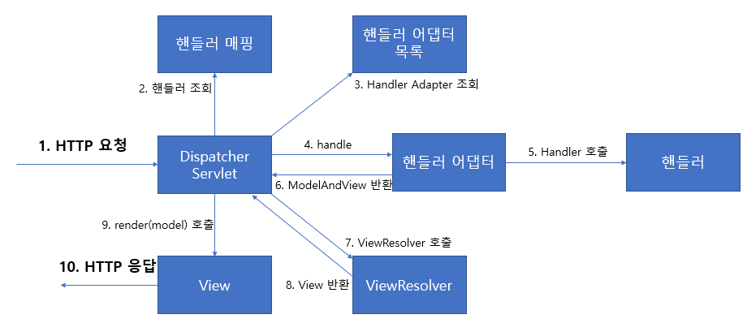

# Spring MVC

## Web Application
### Web Server?
* 웹 서버는 HTTP기반으로 동작하는 서버이다.
* 정적 리소스를 제공하며, 기타 부가기능들을 제공한다. (HTML, CSS, JS, 이미지, 영상 등)
* ex) NGINX, APACHE

### Web Application Server(WAS)?
* HTTP기반으로 동작한다
* web server 기능(정적 리소스 제공)을 포함하고 동적 리소스도 제공 가능하다.
* 프로그램 코드를 실행해서 애플리케이션 로직을 수행할 수 있다.
  * 동적 HTML, HTTP API 
  * 서블릿, JSP, 스프링MVC
* ex) 톰캣(Tomcat), Jetty, Undertow

### 웹 서버 vs 웹 애플리케이션 서버
* 웹 서버는 정적 리소스를 제공하고, WAS는 애플리케이션 로직까지 수행 가능하다.
* 자바의 경우, 서블릿 컨테이너 기능을 제공하면 WAS이다.(서블릿 없이 자바코드를 실행하는 서버 프레임워크도 있긴 함)
* WAS는 애플리케이션 코드를 실행하는데 더 특화되어있다고 생각하면 된다.

### 웹 시스템의 구성
* 웹 시스템은 WAS와 DB만으로 구성 가능하다
* 그러나 이렇게 구성하면 WAS가 너무 많은 역할을 담당한다.
  * 서버에 과부하가 생길 수 있다.
  * 또한 WAS 장애시 오류 화면 제공이 불가능해진다
* 그래서 보통 WEB, WAS, DB로 구성한다. (정적 리소스는 웹 서버가 처리)
* 이렇게 구성하면, 정적 리소스가 많이 사용되면 웹 서버를 증설하면 되고 애플리케이션 리소스가 많이 사용되면 WAS를 증설하면 된다.
* 또한 정적 리소스만 제공하는 웹서버는 잘 죽지 않기 때문에 WAS, DB 장애 시 웹 서버로 오류화면을 제공해 줄 수도 있다.

## Servlet?
* 서블릿은 TCP/IP 연결, HTTP 요청메시지 파싱(데이터 읽기), HTTP 메시지 바디 내용 파싱,  HTTP메시지 생성, TCP/IP 응답 전달 등 모두 자동으로 해준다.
* 덕분에 개발자는 비즈니스 로직만 잘 구현하면 된다. 
* urlPatterns의 URL이 호출되면 서블릿 코드가 실행된다.
* HTTP 요청 정보를 편리하게 사용할 수 있는 HttpServletRequest가 있다.
* 반대로 HTTP 응답 정보를 편리하게 제공할 수 있는 HttpServletResponse가 있다.
* 서블릿으로 인해 개발자는 HTTP를 매우 편리하게 사용할 수 있다. (물론 HTTP는 기본적으로 알고 있어야 함)


### Servlet 동작
* WAS는 Request, Response 객체를 새로 만들어서 서블릿 객체를 호출한다.
* 개발자는 Request 객체에서 HTTP 요청 정보를 편리하게 꺼내서 사용한다.
* 개발자는 Response 객체에 HTTP 응답 정보를 편리하게 입력한다.
* WAS는 Response 객체에 담겨있는 내용으로 HTTP 응답 정보를 생성한다.

### Servlet Container?
* 톰캣과 같이 서블릿을 지원하는 WAS를 서블릿 컨테이너라고 한다.
* 서블릿 컨테이너는 서블릿 객체를 생성, 초기화, 호출, 종료하는 생명주기를 관리한다.
* 서블릿 객체는 싱글톤으로 관리한다.
  * 최초 로딩 시점에 서블릿 객체를 미리 만들어두고 재활용 한다. (요청이 올때마다 객체를 생성하는 것은 비효율적)
  * 모든 고객 요청은 동일한 서블릿 객체 인스턴스에 접근한다. (공유 변수 사용에 주의해야 함)
  * 서블릿 컨테이너 종료 시 서블릿 객체도 종료된다.
* JSP도 서블릿으로 변환되어서 사용한다.
* 동시 요청을 위한 멀티쓰레드 처리를 지원한다.
  * 동시에 많은 유저가 요청을 해도 서버가 요청을 잘 처리한다. 
  * 따라서 개발자는 멀티쓰레드에 대해서 크게 신경을 쓰지 않아도 WAS가 자동으로 해결해준다.)
## 쓰레드
* 쓰레드는 쉽게 말하면 애플리케이션 코드를 하나씩 순차적으로 실행하는 것이다.
* 자바 메인 메서드를 처음 실행하면 main이라는 이름의 쓰레드가 실행된다.
* 쓰레드가 없으면 자바 애플리케이션 실행이 불가능하다.
* 쓰레드는 한번에 하나의 코드만 수행한다.
* 동시처리가 필요하다면 쓰레드를 추가로 생성해야 한다.
### 요청 마다 쓰레드 생성하는 방법
#### 장점
* 동시 요청을 처리할 수 있다.
* 리소스(CPU, 메모리)가 허용할 때까지 처리 가능하다.
* 하나의 쓰레드가 지연 되어도 나머지 쓰레드는 정상 동작한다.

#### 단점
* 쓰레드는 생성비용이 비싸다.
  * 고객 요청이 올때마다 쓰레드를 생성하면 응답 속도가 늦어진다.
* 쓰레드는 컨텍스트 스위칭 비용이 발생한다.
* 쓰레드 생성에 제한이 없으므로, 요청이 너무 많이 오면 리소스(CPU, 메모리)의 한계로 서버가 죽을 수 있다.

### 쓰레드 풀
* 요청마다 쓰레드를 생성하는 방법의 단점을 보완한다.
* 필요한 쓰레드를 쓰레드 풀에 보관하고 관리한다.
* 쓰레드 풀에 생성 가능한 쓰레드의 최대치를 관리한다. (톰캣은 최대 200개가 기본 설정이고, 변경 가능함)
* 쓰레드가 필요하면 이미 생성되어 있는 쓰레드를 쓰레드 풀에서 꺼내서 사용한다.
* 사용을 종료하면 쓰레드 풀에 해당 쓰레드를 반납한다.
* 최대 쓰레드가 모두 사용중이라 쓰레드 풀에 쓰레드가 없으면, 요청을 거절하거나 특정 숫자만큼만 대기하도록 설정할 수 있다.
#### 장점
* 쓰레드가 미리 생성되어 있으므로, 쓰레드를 생성하고 종료하는 비용(CPU)이 절약된다.
* 따라서 응답시간이 빨라진다.
* 생성가능한 쓰레드의 최대치가 있기 때문에, 너무 많은 요청이 들어와도 기존 요청은 안전하게 처리할 수 있다.
#### 쓰레드 풀 사용 팁
* WAS의 주요 튜닝 포인트는 최대 쓰레드 수이다.
* 최대 쓰레드 수를 너무 낮게 설정하면, 동시 요청이 많을 때 서버 리소스는 여유롭지만 클라이언트는 금방 응답지연이 생긴다.
* 최대 쓰레드 수를 너무 높게 설정하면, 동시 요청이 많을 때 리소스(CPU, 메모리)의 한계로 서버가 죽을 수 있다.
* 만약 장애 발생시, 클라우드면 일단 서버부터 늘리고 이후에 튜닝을 하면된다.
* 클라우드가 아닐 시 적당하게 튜닝을 잘 해야한다.
  * 애플리케이션 로직의 복잡도나, CPU, 메모리, IO리소스 상황에 따라 모두 달라진다.
  * 따라서 이럴 경우 성능 테스트를 통해 적정 숫자를 찾아야 한다.
  * ex) 아파치 ab, 제이미터, nGrinder

### WAS에서의 멀티 쓰레드
* 멀티 쓰레드에 대한 부분은 WAS가 처리한다.
* 개발자는 멀티쓰레드 관련 코드를 신경쓰지 않아도 된다.
  * 싱글쓰레드 프로그래밍 하듯이 편리하게 소스코드를 개발하면 된다.
* 멀티 쓰레드 환경이기 때문에, 싱글톤 객체(서블릿, 스프링 빈)는 주의해서 사용해야 한다. (공유 변수 등 조심)


## 템플릿 엔진
* 서블릿과 자바 코드만으로 HTML을 만들면, 코드가 매우 복잡하고 비효율적이다.
* HTML문서에 동적으로 변경해야 하는 부분만 자바 코드를 넣을 수 있다면 훨씬 편해진다.
* 그래서 생긴게 템플릿 엔진이다.
* 템플릿 엔진을 이용하면 HTML문서에서 필요한 곳만 코드를 적용해서 동적으로 변경할 수 있다.
* ex) JSP, **Thymeleaf**, Freemarker, Velocity 등

## 서블릿, JSP의 한계
* 서블릿과 자바코드만으로 개발하면 뷰를 위한 HTML을 만드는 작업이 자바 코드에 섞이기 때문에 지저분하고 복잡하다
* JSP만 사용하면 뷰를 생성하는 HTML작업을 깔끔하게 분리시킬 수 있다.
  * 추가로 중간 중간 동적으로 변경이 필요한 부분에만 자바 코드를 적용하면 된다.
* 하지만 JSP를 보면, 절반은 비즈니스 로직이고, 절반은 뷰를 위한 영역이다.
* 결국 **JSP가 너무 많은 역할을 하게 되고, 만약 프로젝트가 커질수록 유지보수가 굉장히 힘들어 진다.**
* 이러한 문제를 해결하기 위해 MVC패턴이 등장했다.
  * 비즈니스 로직은 서블릿처럼 다른 곳에서 처리하고, JSP는 목적에 맞게 HTML을 그리는 일에만 집중할 수 있게 된다.

## MVC 패턴 (Model View Controller)
* 하나의 서블릿이나 JSP만으로 비즈니스 로직과 뷰 렌더링까지 모두 처리하게 되면 너무 많은 역할을 하게 된다. (결국 유지보수가 어려워짐)
* 특히 JSP 같은 뷰 템플릿은 화면을 렌더링하는데 최적화 되어 있기 때문에 이 부분의 업무만 담당하는 것이 가장 효과적이다.
* MVC패턴은 하나의 서블릿이나 JSP로 처리하던 것을, 컨트롤러와 뷰라는 영역으로 서로 역할울 나눈 것을 말한다.
* 웹 애플리케이션은 보통 이 MVC패턴을 사용한다.
### 컨트롤러
* HTTP요청을 받아서 파라미터를 검증하고, 비즈니스 로직(Service)을 실행한다.
* 뷰에 전달할 결과데이터를 조회해서 모델에 담는다.
> Service
> 
> * 컨트롤러에 비즈니스 로직을 둘 수도 있지만, 이러면 컨트롤러가 너무 많은 역할을 담당한다.
> * 일반적으로 비즈니스 로직은 서비스라는 계층을 별도로 만들어 처리한다.
> * 컨트롤러는 비즈니스 로직이 있는 서비스를 호출하는 역할을 담당한다.

### 모델
* 뷰에 출력할 데이터를 담아둔다.
* 뷰가 필요하면 데이터를 모두 모델에 담아 전달해주는 덕분에 뷰는 비즈니스 로직이나 데이터 접근을 몰라도 된다.
* 결국 뷰는 화면을 렌더링 하는 일만 신경쓸 수 있게 된다.

### 뷰
* 모델에 담겨있는 데이터를 사용해서 화면을 그리는 일에 담당한다.

### MVC패턴의 한계
* MVC패턴을 적용하면 컨트롤러의 역할과 뷰를 렌더링하는 역할을 명확하게 구분할 수 있다.
* 뷰는 화면을 그리는 역할만 신경써도 되기 때문에 코드가 깔끔해지고 직관적이다. (모델에서 필요한 데이터를 꺼내고 화면을 만들면 됨)
* 하지만 컨트롤러에서는 코드의 중복이 많고, 필요하지 않은 코드들도 생기게 된다.
  * View로 이동하는 코드가 항상 중복 호출된다.
  * ViewPath가 중복된다.
  * 상황에 따라 `HttpServletRequest`, `HttpServletResponse`를 사용하지 않을 때도 있고, 테스트 케이스를 작성하기도 어렵다.
* 공통 처리가 어렵다.
  * 기능이 많아질수록 컨트롤러에서 공통으로 처리해야 하는 부분이 많아진다.
  * 공통 기능을 메서드로 만들어 사용해도 될 것 같지만, 결국 그 메서드도 항상 호출해야 한다.

* 이러한 문제를 해결하기 위해선 컨트롤러 호출 전에 먼저 공통 기능을 처리해주면 된다.
* **프론트 컨트롤러 패턴을 도입하면 이러한 문제를 해결**할 수 있다. (스프링 MVC의 핵심)

## FrontController패턴
* 프론트 컨트롤러 서블릿 하나로 클라이언트의 요청을 받는다.
* 프론트 컨트롤러가 요청에 맞는 컨트롤러를 찾아서 호출한다.
* 따라서 공통 처리가 가능하다.
* 또한 프론트 컨트롤러를 제외한 나머지 컨트롤러는 서블릿을 사용하지 않아도 된다.
* **스프링 웹 MVC의 `DispatcherServlet`이 프론트 컨트롤러 패턴으로 구현**되어 있다.


## Spring MVC
* Spring MVC의 주요 구성 요소는 MVC패턴의 Model, View, Controller에 추가적으로 DispatcherServlet(Front Controller)가 있다.
* MVC패턴 + FrontControllder패턴 이라고 생각하면 된다.
* 프론트 컨트롤러인 DispatcherServlet로 인해 컨트롤러에서의 공통 처리가 가능해졌고, 또한 컨트롤러들은 서블릿을 사용하지 않아도 된다.
* 굉장이 유연하고 확장성 있게 웹 어플리케이션을 만들 수 있다.

### 동작 순서

1. HTTP 요청이 들어온다.
2. 핸들러 조회 : 핸들러 매핑을 통해 요청 URL에 매핑된 핸들러를 조회한다.
3. 핸들러 어댑터 조회 : 핸들러를 실행할 수 있는 핸들러 어댑터를 조회한다.
4. 핸들러 어댑터 실행 : 핸들러 어댑터를 실행한다.
5. 핸들러 실행 : 핸들러 어댑터가 실제 핸들러를 실행한다.
6. ModelAndView 반환 : 핸들러 어댑터는 핸들러가 반환하는 정보를 ModelAndView로 변환해서 반환한다.
7. viewResolver 호출 : 뷰 리졸버를 찾고 실행한다.
8. View 반환 : 뷰 리졸버는 뷰의 논리 이름을 물리 이름으로 바꾸고, 렌더링 역할을 담당하는 뷰 객체를 반환한다.
9. 뷰 렌더링 : 뷰를 통해서 뷰를 렌더링 한다.

## @RequestMapping
* 과거 스프링은 유연한 컨트롤러를 제공하지 못했다.
  * 과거 스프링은 MVC부분이 부족해 MVC 웹 기술은 스트럿츠와같은 다른 프레임워크를 사용했다.
* 스프링은 애너테이션을 활용한 매우 유연하면서 실용적인 컨트롤러를 만들었다.
* `@RequestMapping` 애너테이션을 사용한 컨트롤러이며, 실무에서는 대부분 이 방식의 컨트롤러를 사용한다.
  * `@RequestMapping`기반의 애너테이션 컨트롤러가 등장하면서, 이제는 대부분 MVC 웹 기술도 스프링을 사용한다.
* 스프링에서 가장 우선순위가 높은 매핑과 핸들러는 `RequestMappingHandlerMapping`, `RequestMappingHandlerAdapter`이다.
  * `@RequestMapping`의 앞글자를 따서 만들었다.


### @RequestMapping의 옵션
#### value
* 연결할 URL을 말한다.
* 보통 호스트 주소와 포트번호를 제외하고 api설계 규약에 따라 이름을 짓는다.
  ```java
  @RequestMapping(value = "/hello")
  ```

* `{}`사이에 변수를 넣어서 url을 매핑하는 것도 가능하다.
  ```java
  @RequestMapping(value = "/hello/{id}")
  ```
  * 이 경우 메서드 파라미터로 `@PathVariable`을 id로 받으면 된다.
* `@RequestMapping`은 컨트롤러의 클래스단에 붙이면, 공통되는 URL을 뽑아서 사용할 수 있다.
  ```java
  @RestController
  @RequestMapping("/hello")
  public class HelloController{
    @RequestMapping("/spring")  // hello/spring
    public String helloSpirng(){
        return "ok";
    }
  }
  ```

#### method
* `@RequestMapping`은 URL만 매칭하는 것이 아니라 HTTP Method도 함께 구분할 수 있다.
* URL이 `/members`이고, HTTP Method가 GET인 경우 아래와 같이 처리하면 된다.
  ```java
  @RequestMapping(value = "/hello", method = RequestMethod.GET)
  ```
* GET, POST, PUT, DELETE, PATCH 등을 적용할 수 있다.
* 위의 HTTP Method들은 `@GetMapping`, `@PostMapping`과 같이 애너테이션으로 더 편하게 구분하여 사용할 수 있다.
  ```java
  @GetMapping("/members")   // value만 있으면 생략 가능
  ```
  * 해당 애너테이션들의 원리는 단순하다.
  * @GetMapping 애너테이션 안에는 `@RequestMapping(method = RequestMethod.GET)`가 들어있다.


#### consumes
* 처리 가능한 미디어 타입의 목록을 지정해서 매핑을 제한할 수 있다.
* Content-Type Header가 consumes에 지정한 미디어 타입과 일치할 때만 매핑이 된다.
  ```java
  @GetMapping(value = "/hello", consumes = "application/json")
  ```
#### produces
* 응답 가능한 미디어 타입의 목록을 지정해서 매핑을 제한할 수 있다.
* Accept Header가 produces에 지정한 타입과 일치할 때만 해당 타입으로 응답을 보내준다.
  ```java
  @GetMapping(value = "/hello", produce = "MediaType.APPLICATION_JSON_VALUE")
  ```
  
## HTTL 요청
* 클라이언트에서 서버로 요청 데이터를 전달할 때는 보통 3가지 방법을 사용한다.
1. GET - 쿼리 파라미터
   * /hello?username=hello&age=30
   * 메시지 바디 없이 URL의 쿼리 파라미터에 데이터를 포함해서 전달하는 방법이다
   * ex) 검색, 필터, 페이징 등에서 많이 사용한다.
2. POST - HTML Form
   * content-type : application/x-www-form-urlencoded
   * 메시지 바디에 쿼리 파라미터 형식으로 전달한다 username=hello&age=30
   * 예)회원 가입, 상품 주문, HTML Form 사용
3. HTTP message body에 데이터를 직접 담아서 요청
   * HTTP API에서 주로 사용한다.
   * 데이터 형식은 주로 JSON을 사용한다
   * POST, PUT, PATCH

## HTTP 요청 파라미터
* GET 쿼리 파라미터 전송 방식과, POST HTML Form전송 방식 둘다 형식이 같으므로 구분없이 조회할 수 있다.
* 이것을 요청 파라미터 조회라고 한다.
### @RequestParam
* Spring이 제공하는 `@RequestParam`을 사용하면 요청 파라미터를 편리하게 사용할 수 있다.
* 파라미터 이름으로 바인딩 한다.
* /hello?username=hello&age=30과 같이 요청이 들어오면 `@RequestParam의 파라미터 이름에 맞게 세팅된다.
  ```java
  @GetMapping("/hello")
  public String helloParam(@RequestParam("username") String username,
                           @RequestParam("age") int age){
    return "ok";
  }
  ```
* `@RequestParam("username") String username`과 같이 파라미터 이름이 변수 이름과 같으면 파라미터를 생략할 수 있다.
  * `@RequestParam String username`
#### @RequestParam 옵션
##### required
* `required` 옵션을 통해 파라미터 필수 여부를 정할 수 있다.
* `@RequestParam(required = false) String username`
* 기본값은 은true이다(필수)

##### defaultValue
* 파라미터에 값이 없는 경우 `defaultValue` 옵션을 통해 기본 값을 적용할 수 있다.
* `@RequestParam(defaultValue = "guest") String username`
* 만약 사용한다면 이미 기본값이 있는 것이기 때문에 `required` 옵션의 의미는 사라진다.
* 
### @ModelAttribute
* 실제 개발 시 요청 파라미터를 받아서 필요한 객체를 만들고, 그 객체에 값을 넣어주어야 한다.
* 스프링은 이 과정을 자동화해주는 `@ModelAttribute`기능을 제공한다.

```java
@Data
public class MemberData{
    private String username;
    private int age;
}
```
```java
@ResponseBody
@RequestMapping("/hello")
public String modelAttributeV1(@ModelAttribute(name="memberData") MemberData memberData) {
    return "ok";
}
```
* 위 코드와 같이 해도 Model에 자동으로 저장이 된다. (view단에서 사용 가능)
  * `@ModelAttribute`의 `name` 옵션을 통해 Model의 attributeName을 설정할 수 있다. 
  * `name` 옵션은 생략하면 맨 앞글자를 소문자로 해서 저장해 준다.
### @RequestParam, @ModelAttribute의 생략
* 둘다 상황에 따라 생략해서 사용할 수 있다.
* 스프링은 해당 애너테이션들을 생략 시 String, int와 같은 단순 타입은 @RequestParam을 사용하고, 나머지들은 @ModelAttribute(argument resolver로 지정해둔 타입 외)를 사용한다.
* 둘다 생략이 가능하기 때문에 혼란이 발생할 수 있다.

## HTTP 요청 메시지
* HTTP message body에 데이터를 직접 담아서 요청한다.
* 요청 파라미터와 다르게, HTTP 메시지 바디를 통해 데이터가 직접 넘어오는 경우에는 `@RequestParam`, `@ModelAttribute`를 사용할 수 없다.
  * HTML Form형식으로 전달되는 경우는 요청파라미터로 인정된다.

### @RequestBody
* `@RequestBody`를 사용하면 HTTP메시지 바디 정보를 편리하게 조회할 수 있다. 
  * `@RequestParam`과 `@ModelAttribute`와는 전혀 관계가 없다. (이 두개는 요청 파라미터를 조회하는 기능임)
  * `@RequestBody`는 HTTP 메시지 바디를 직접 조회하는 기능이다.
* `@RequestBody`에 직접 만든 객체를 지정할 수 있다.
* `@RequestBody`를 사용하면 HTTP 메시지 컨버터가 HTTP 메시지 바디의 내용을 원하는 문자나 객체 등으로 변환해준다.
* HTTP메시지 컨버터는 문자 뿐만 아니라 JSON도 객체로 변환해준다.
#### @RequestBody 생략?
* `@RequestBody`은 생략할 수 없다.
* 스프링은 `@RequestParm`, `@ModelAttribute`을 생략하면 특정 규칙을 적용해 인식한다. (위에서 정리함)
* `@RequestBody`를 생략하면 `@ModelAttribute`가 적용되어 버리므로 생략할 수 없다. (요ㅊ)

## HTTP 응답
* 스프링에서 응답 데이터를 만드는 방법은 크게 3가지이다.

1. 정적 리소스
   * 웹 브라우저에 정적인 HTML, css, js를 제공할 때는 정적 리소스를 사용한다.
2. 뷰 템플릿 사용
   * 웹 브라우저에 동적인 HTML을 제공할 때는 뷰 템플릿을 사용한다.
3. HTTP 메시지 사용
   * HTTP API를 제공하는 경우에는 HTML이 아니라 데이터를 전달해야 하므로, HTTP메시지 바디에 JSON같은 형식으로 데이터를 실어보낸다.

### 정적 리소스
* 스프링 부트는 클래스패스의 아래 디렉토리에 있는 정적 리소스를 제공한다.
  * `/static`, `/public`, `resources`, `/META-INF/resources`
  * 설정을 통해 위치를 변경할 수 있고, 설정을을 따로 하지 않았으면 위의 경로 중 한곳에 생성해야 자동으로 리소스를 찾아준다.
* `src/main/resources`는 리소스를 보관하는 곳이고, 클래스패스의 시작 경로이다.

* 만약 `src/main/resouces/static/basic/hello.html`과 같이 `hello.html`이 들어있으면, 웹 브라우저에서는 `http://localhost:8080/basic/hello.html`과 같이 실행하면 된다
* 정적 리소스는 해당 파일을 변경 없이 그대로 보여주는 것이다.

### 뷰 템플릿
* 뷰 템플릿을 거쳐서 HTML이 생성되고, 뷰가 응답을 만들어서 전달한다.
* 일반적으로 HTML을 동적으로 생성하는 용도로 사용하며, 다른 것들도 가능하다.(뷰 템플릿이 만들 수 있는것이면 모두 가능)
* 스프링 부트는 아래와 같은 경로에 기본 뷰 템플릿 경로를 제공한다.
  * `src/main/resources/templates`
* `@ReponseBody`가 없으면 해당 경로로 뷰 리졸버가 실행되어 뷰를 찾고, 렌더링한다.
* `@ReponseBody`가 있으면 뷰 리졸버를 실행하지 않고, HTTP 메시지 바디에 직접 해당 경로의 문자가 입력된다.
### HTTP API, 메시지 바디에 직접 입력
* HTTP API를 제공하는 경우 HTML이 아니라 데이터를 전달해야 하므로, HTTP 메시지 바디에 JSON같은 형식으로 데이터를 실어 보낸다.
  * 정적 리소스나 뷰 템플릿을 거치지 않고 직접 HTTP 응담 메시지를 전달하는 경우를 말한다.

## HTTP 메시지 컨버터