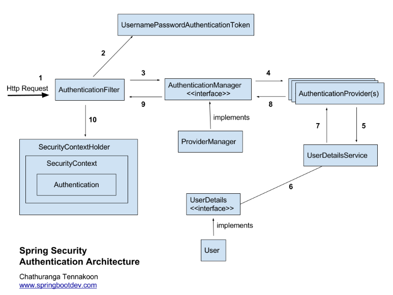

# Spring Security
## Spring Security?
* Spring Framework 기반 애플리케이션의 인증(Authentication)과 인가(Authorization) 기능을 가진 프레임워크다.
* 모든 자바 애플리케이션에 적용 가능하지만 웹 애플리케이션에서 많이 쓰이고 있다.
* 스프링 시큐리티는 인증과 인가에 대한 부분을 Servlet Filter기반으로 처리하고 있다.(SpringMVC와 같은 특정 웹 기술과의 의존성은 없음)
  > Filter vs Interceptor
  > * Filter는 DispatcherServlet 전에 적용되므로 가장 먼저 URL요청을 받는다
  > * Interceptor는 DispatcherServlet과 Controller 사이에 위치하기 때문에 Filter와의 적용 시기의 차이가 있다.
* 애플리케이션의 보안 절차를 일일이 구축하고 관리하는 것은 굉장히 힘든 일이지만, Spring Security는 이미 잘 구성된 체계적인 보안 흐름과 그에 포함된 다양한 모듈을 제공해준다.
  * 개발자가 직접 제로베이스에서 보안 로직을 작성하지 않아도 체계화된 보안 프로세스를 적용할 수 있다.
* 스프링의 대부분 프로젝트들처럼 확장성을 고려한 프레임워크 이므로, 다양한 기능들을 손쉽게 추가하고 변경할 수 있다.
* Java8 이상에서만 사용할 수 있다.
> 용어 정리
> 
> 접근 주체(Principal)
> * 보호된 리소스에 접근하는 대상이다.
> 
> 인증(Authentication)
> * 특정 리소스에 접근하려고 하는 사용자가 누구인지 확인할 때 사용한다.
> * 주체의 신원을 증명하는 과정이다.
>   * 주체가 인증을 위해 신원증명정보를 제시한다.
>   * 주체가 유저일 경우 신원증명정보는 패스워드다.
> 
> 인가(Authorization)
> * 인증을 마친 유저에게 권한을 부여하여 애플리케이션의 특정 리소스에 접근할 수 있게 허가하는 과정이다.
> * 인가는 반드시 인증 과정 이후에 수행되어야 하며, 권한은 롤 형태로 부여하는게 일반적이다.
> 
> 권한
> * 인증된 주체가 애플리케이션의 동작을 수행할 수 있도록 허락 되었는지 확인한다.
> * 권한 승인이 필요한 부분으로 접근하려면 인증 과정을 통해 주체가 증명되어야 한다.
> * 권한 부여 영역
>   * 웹 요청 권한
>   * 메서드 호출 및 도메인 인스턴스에 대한 접근 관한


## Spring Security의 기능
* 모든 요청에 대해서 인증을 요구한다
* username/password를 가진 사용자가 양식 기반 인증을 제공해준다.
* BCrypt로 암호 저장소를 보호해준다.
* 사용자의 로그아웃 기능을 제공해준다.
* CSRF(Cross-Site Request Forgery)공격을 방지한다.
* Session Fixation(세션 고정 공격)을 보호한다.
* 보안 헤더 통합
  * 보안 요청을 위한 Http Strict Transport Security
  * X-Content-Type-Options 통합
  * 캐시제어
  * X-XSS-Protection 통합
  * 클릭재킹을 방지하는 X-Frame-Options 통합
* Servlet API 메서드와의 통합

## Spring Security 사용 방법
* Seuciryty 관련 Config 클래스에 `@EnableWebSecurity`를 적용하면 웹 보안 활성화를 위한 여러 클래스들을 import해준다. (SpringSecurityFilterChain에 등록되며, 스프링 시큐리티를 사용)
* filterChain 메서드를 생성하여 빈에 등록하며, 여기서 인자로 사용되는 `HttpSecurity`클래스가 있고, 이 클래스에서 인증과 관련된 API들이 제공된다.
* HttpSecurity 클래스를 http 라는 이름의 인자로 받아와 제공되는 메서드들을 실행한다.
``` java
@Configuration
@EnableWebSecurity
public class SecurityConfig {

    @Bean
    public SecurityFilterChain filterChain(HttpSecurity http) throws Exception {
        http.csrf().disable();   // form태그로만 요청이 가능해지고 postman등의 요청이 불가능해 진다.
				http.headers().frameOptions().disable(); // h2연결을 위해 필요한 세팅

        http.authorizeRequests()
                .antMatchers("/user/**").authenticated()    // URL중 이 패턴을 포함하는 경우에 대해서는 인증된 사용자만 접근 가능
                .antMatchers("/manager/**").access("hasRole('ROLE_ADMIN') or hasRole('ROLE_MANAGER')")  // SpEL표현식에 의한 결과에 따라 접근 가능
                .antMatchers("/admin/**").access("hasRole('ROLE_ADMIN')")
                .anyRequest().permitAll()   // 어떤 요청이던지 인증이 되어야 한다.
                .and()
                .formLogin()  // formLogin방식을 사용
                .loginPage("/login")   // 로그인 URL
        return http.build();
    }

}
```

## Filter
* 스프링 시큐리티는 Servlet Filter기반으로 인증과 인가에 대한 부분을 처리하고 있다.
* 클라이언트가 서버로 요청을 하게 되면 먼저 Servlet Filter를 거치게 된다.
* Filter를 모두 거치고 난 후 `DispatcherServlet`과 같은 Servlet에서 요청이 처리된다.

### FilterChain
* `FilterChain`은 의미 그대로 여러개의 Filter들이 사슬처럼 연결되어 연쇄적으로 동작한다.
* 하나의 서블릿은 단일요청을 처리하지만 필터는 체인을 형성하여 실제 요청을 순서대로 수행한다.
* Filter의 순서는 2가지 방법으로 지정 가능한데, `@Order`애너테이션이나 `Ordered`를 구현하는 방법과, `FilterRegistrationBean`을 이용해 순서를 설정하여 필터를 등록하는 방법이 있다.


### DelegatingFilterProxy
* 우선 사용자가 처음 요청을 하면 서블릿 필터를 거치게 된다.
* 스프링 시큐리티에서 사용하는 필터들은 스프링 빈으로 등록이 되어있고, 이 빈들은 서블릿 필터에서는 사용이 불가능 하다. (스프링 컨테이너, 스프링 컨테이너)
* 그래서 이 스프링 시큐리티 필터들을 수행해 줄 필터가 필요한데 그 역할을 `DelegatingFilterProxy`가 한다.
* `DelegatingFilterproxy`는 서블릿 컨테이너에 등록되어 있다.
* `DelegatingFilterproxy`에서는 `ApplicationContext`에서 `FilterChainproxy`라는 빈을 찾아 보안처리를 위임한다.

### FilterChainProxy
* `springSecurityFilterChain`이름으로 생성되는 스프링 빈이다.
* `DelegatingFilterProxy`로 부터 요청을 위임 받고 실제 보안 처리를 한다.
* 스프링 시큐리티가 초기화될 때 관리할 필터들을 결정한다. (기본필터 + 설정한 추가필터)
* 필터를 순서대로 호출해서 사용자 요청을 각각의 필터에 전달한다
* 마지막 필터까지 예외가 발생하지 않으면 인증에 성공한다.

## Spring Security Filter 종류
### SecurityContextPersistenceFilter
* 요청이 발생하면 `SecurityContext` 객체의 생성, 저장 및 조회를 담당하는 필터다.

### CsrfFilter
* CSFR 공격을 방어하는 FIlter이다.
* 
### Logout Filter
* 로그아웃을 시키는 필터이다.
* 설정된 로그아웃 URL로 오는 요청을 확인하여 해당 유저를 로그아웃 처리한다.

### UsernamePasswordAuthenticationFilter
* 설정된 로그인 URL로 오는 요청을 확인하여 유저 인증을 처리한다.

### DefaultLoginPageGeneratingFilter
* 사용자가 별도의 로그인 페이지를 구현하지 않은 경우, 스프링 시큐리티에서 기본적으로 제공하는 로그인 폼 페이지를 생성해주는 필터이다.

### BasicAuthenticationFilter
* HttpBasic 인증을 처리하는 필터이다.
  * HttpBasic이란 Header에 username, password를 실어 보내면 브라우저 혹은 서버가 그 값을 읽어 인증하는 방식이다.
  * 보통 브라우저 기반 요청이 클라이언트의 요청을 처리할 때 자주 사용한다. (보안에 상당히 취약하므로 Https 권장)

### RememberMeAuthenticationFilter
* 세션이 만료되고 웹 브라우저가 종료된 후에도 어플리케이션이 사용자를 기억할 수 있도록 하는 필터이다.

### AnonymousAuthenticationFilter
* 인증객체가 없는 익명의 사용자를 위한 필터로, 특정 자원에 접근 시도시 인증객체를 검사하는데, 만약 인증객체가 없을 경우 익명사용자용 인증 객체를 생성해준다.

### SessionManagementFilter
* 세션 관련 활동을 수행하는 필터이다.
  * 세션관리
  * 동시 세션 제어
  * 세션 고정 보호
  * 세션 생성 전략 설정

### ExceptionTranslationFilter
* 필터체인 내에서 발생하는 예외를 처리하는 필터이다.

### FilterSecurityInterceptor
* 대부분의 경우 가장 마지막에 사용되며, 리소스에 접근하기 전 인가 처리를 하는 필터이다.

## Spring Security의 인증 처리 과정 (UsernamePasswordAuthenticationFilter)


출처:https://sjh836.tistory.com/165
1. 사용자로부터 요청을 받으면 `AuthenticationFilter`가 요청을 받아 인증을 진행한다.
2. `UsernamePasswordAuthenticationFilter`를 통해 username과 password를 `UsernamePasswordAuthenticationToken`객체를 만든다.
3. 이 만들어진 토큰은 검증을 위해 `AuthenticationManager`의 구현체인 `ProviderManager`로 전달된다.
4. `AuthenticationManager`는 등록된 `AuthenticationProvier`를 조회하여 인증을 요구한다.
5. 실제 DB에서 사용자 인증 정보를 가져오는 `UserDetailsService`에 사용자 정보를 넘겨준다.
6. 넘겨받은 사용자 정보를 통해 DB에서 찾은 사용자 정보인 `UserDetails` 객체를 만든다.
7. `AuthenticationProvider`는 `UserDetails`를 넘겨받아 사용자 정보를 비교한다.
8. 인증이 완료되면 권한등의 사용자 정보를 담은 `Authentication` 객체를 반환한다.
9. `AuthenticationFilter`에도 `Authentication` 객체가 반환된다.
10. `Authentication` 객체를 `SecurityContext`에 저장한다.

### Authentication
* 사용자의 인증 정보를 저장하는 토큰 개념으로 사용된다.
* 인증 시 username과 password를 담고 인증 검증을 위해 사용된다.
* 인증 후엔 최종 인증결과를 담으며, `SecurityContext`에 저장되어 전역적으로 참조가 가능하다.
  * `principal` : 사용자 아이디나 객체를 저장
  * `credentials` : 사용자 비밀번호
  * `authorities` : 인증된 사용자의 권한 목록
  * `details` : 인증 부가 정보
  * `Autenticated` : 인증 여부 (Boolean)
### SecurityContext
* `Authentication` 객체가 저장되는 저장소로 필요시 `Authentication` 객체를 꺼내서 쓸 수 있다.
* `ThreadLocal`에 저장되어 아무 곳에서나 참조가 가능하도록 설계되어있다.
* 인증이 완료되면 `HttpSession`에 저장되어 애플리케이션 전반에 걸쳐 전역적인 참조가 가능해진다.

### SecurityContextHolder
* `SecurityContext`객체를 저장하고 감싸고 있는 wrapper 클래스이다.
* `SecurityContext`객체를 3가지 저장방식에 따라 저장을 한다.
  * `MODE_THREADLOCAL` : 스레드당 SecurityContext객체를 할당한다. (default)
  * `MODE_INHERITABLETHREADLOCAL` : 메인 스레드와 자식 스레드에 관하여 동일한 `SecurityContext`를 유지한다.
  * `MODE_GLOBAL` : 응용 프로그램에서 단 하나의 `SecurityContext`를 저장한다. (메모리에서 단 하나의 `SecurityContext`를 가지고 참조)
* `SecurityContextholder.clearContext()`는 SecurityContext 기본 정보 초기화 메서드이다.

### UsernamePasswordAuthenticationFilter
* 인증 요청에 대한 인증을 수행하는 Filter이다.
* 요청이 들어오고 만약 `RequestMatcher`와 매칭되지 않으면 이 필터는 아무작업도 수행하지 않고 `FilterChain`은 계속 진행 된다.
* 매칭이 되면 `AuthenticationFilter`에 명시된 `AuthenticationManager`를 사용하여 인증을 수행한다.
* 인증에 성공하면 `AuthenticationSuccessHandler`가 호출되고, 인증이 `SecurityContext`에 저장된다.
* 인증에 실패하면 `AuthenticationFailureHandler`가 호출된다.

### UsernamePasswordAuthenticationToken
* `Authentication`을 구현한 `AbstractAuthenticationToken`의 하위 클래스이다.
* username은 `Principal`의 역할을 하고, password는 `Credential`의 역할을 한다.
* 2개의 생성자가 있으며, 인증 전의 객체를 생성하는 생성자와, 인증이 완료된 객체를 생성하는 생성자가 있다.

### Authentication Manager
* 인증에 대한 부분은 SpringSecurity의 `AuthenticationManager`를 통해 처리하게 되며, `AuthenticationManager`에 등록된 `AuthenticationProvider`에 의해 처리된다.
* 인증에 성공하면 인증이 성공한 `Authentication` 객체를 생성하며, 인증에 실패한 경우 `AuthenticationException`을 발생시킨다.
* `AuthenticationManager`를 구현한 `ProviderManager`는 실제 인증 과정에 대한 로직을 갖고 있는 `AuthenticationProvider`를 List로 가지고 있으며, 모든 provider들을 조회하며 인증 처리를 한다.
* `ProviderManager`에는 직접 Custom한 `AuthenticationProvider`를 등록할 수 있고, 등록 방법은 SecurityConfig에서 빈으로 등록하면 된다.

### UserDetails
* 사용자의 정보를 담는 인터페이스이다.
* 사용자의 정보를 불러오기 위해 구현해야 하는 인터페이스로, 기본 오버라이드 메서드들이 있다.
  * `getAuthorities()` : 계정의 권한 목록을 가져옴
  * `getPassword()` : 계정의 비밀번호를 가져옴
  * `getUsername()` : 계정의 id를 가져옴
  * `isAccountNonExpired()` : 계정의 만료 여부 (true면 만료 안됨)
  * `isAccountNonLocked()` : 계정의 잠김 여부 (true면 잠기지 않음)
  * `isCredentialsNonExpired()` : 비밀번호 만료 여부 (true면 만료 안됨)
  * `isEnabled()` : 계정의 활성화 여부 (true면 활성화 됨)


### UserDetailsService
* `UserDetailsService` 인터페이스는 `UserDetails` 객체를 반환하는 단 하나의 메서드만 가지고 있다.
  * `loadUserByUsername` : 유저의 정보를 불러와서 `UserDetails`로 리턴한다.
* 보통 이 인터페이스를 구현한 구현체에서 UserRepository를 주입받아 DB와 연결하여 처리한다.

## SpringSecurity 인가 처리 과정 (FilterSecurityInterceptor)


출처 : https://catsbi.oopy.io/
1. 요청 시 `FilterSecurityInterceptor`에서 요청을 받아 인증여부를 확인한다.
2. 인증 객체가 있으면 `SecurityMetadataSource`는 자원에 접근하기 위해 설정된 권한 정보를 조회해서 전달해준다.
   * 인증 객체 없이 자원에 접근을 시도하게 되면 `AuthenticationException`을 발생시키며, `ExceptionTranslationFilter`에서 해당 예외를 받아 다시 로그인 페이지로 이동 하는 등의 후처리를 한다.
3. 권한 정보가 있을 경우 `AccessDecisionManager`에게 권한 정보를 전달하여 위임한다.
   * 권한 정보가 없으면 권한 심사를 하지 않고 자원 접근을 허용한다.
4. `AccessDecisionManager`는 내부적으로 `AccessDecisionVoter`를 통해 심사를 한다.
5. 반환된 결과(승인, 거부)를 가지고 사용자가 해당 자원에 접근 가능한지 판단한다.
  * 접근이 거부되면 `AccessDeniedException`이 발생하며, `ExceptionTranslationFilter`에서 해당 예외를 받아 다시 로그인 페이지로 이동 하는 등의 후처리를 한다.
6. 접근이 승인되면 자원 접근이 허용된다.

### AccessDecisionManager
* 인증, 요청, 권한 정보를 이용해 사용자의 자원 접근을 허용/거부 여부를 최종 결정한다.
* 여러 개의 Voter들을 가질 수 있고, Voter들로 부터 접근 허용, 거부, 보류에 해당하는 각각의 값을 반환받아 결정한다.
* 최종접근 거부 시 예외가 발생한다.
* 세가지 접근 결정 방법이 있다.
  * `AffimativeBased` : Voter중 하나라도 접근 허가를 승인하면 접근허가가 된다. (or연산자와 같음)
  * `ConsensusBased` : 다수결에 의해 최종 결정을 판단한다.
  * `UnanimousBased` : 모든 Voter가 만장일치로 접근을 승인해야 접근허가가 된다. (and연산자와 같음)

### AccessDecisionVoter
* 판단을 심사하는 인터페이스이다.
* 각각의 Voter들마다 사용자의 요청이 해당 자원에 접근할 권한이 있는지 판단 후 `AccessDecisionManager`그 값을 에게 반환한다.
  * `ACCESS_GRANTED` : 접근 허용 (1)
  * `ACCESS_DENIED` : 접근 거부 (-1)
  * `ACCESS_ABSTAIN` : 접근 보류 (0)

## Logout 처리 과정 (LogoutFilter)
1. 요청이 Logout URL인지 확인한다 (/logout)
2. 맞을 경우 `SecurityContext`에서 인증 객체 `Authentication` 객체를 꺼내온다
3. `SecurityContextLogoutHandler`에서 `SecurityContext`를 삭제하고 해당 인증 객체도 null로 만든다.
4. `SimpleUrlLogoutSuccessHandler`를 통해 로그인 페이지로 리다이렉트 시킨다.

## Remember Me 인증 과정(RememberMeAuthenticationFilter)
1. Remember me 쿠키를 가지고 있는 상태에서 요청을 받는다.
2. `RememberMeAuthenticationFilter`가 동작한다.
3. `RememberMeService`의 구현체가 동작한다.
   * `TokenBasedRememberMeService` : 메모리에서 저장한 토큰과 사용자가 가져온 토큰을 비교
   * `PersistentTokenBasedRememberMeService` : DB에 발급한 토큰과 사용자가 가져온 토큰을 비교
4. 토큰 쿠키를 추출한다.
5. 토큰이 존재하는지 검사한다. (없으면 다음 필터 동작 `chain.doFilter()`)
6. Decode Token으로  토큰의 형식이 규칙에 맞는지 유효성 검사를 한다.
   * 만약 유효하지 않다면 Exception 발생
7. 토큰이 일치하는지 검사한다.
   * 토큰이 일치하지 않으면 Exception 발생
8. 토큰에 계정이 존재하는지 검사한다.
   * 없을경우 Exception 발생 
9. 새로운 `Authentication` 객체를 생성하여 인증처리를 한다.
10. `AuthenticationManager`에게 전달하여 인증처리를 수행한다.

## 익명사용자 인증 과정(AnonymousAuthenticationFilter)
1. 특정 자원에 접근 시도시, 인증 객체를 검사한다.
2. 인증 객체가 없을 경우 익명사용자용 인증 객체를 생성한다.
   * 만약 session을 발급받은 인증객체가 있는 사용자일 경우 해당 객체를 가지고 다음 필터를 동작한다.
3. 인증객체는 세션에 저장하지 않는다.

## 세션 제어 과정(SessionManagementFilter)
1. user1이 로그인요청을 한다.
   * `ConcurrentSessionControlAuthenticationStrategy`에서 세션 허용 개수를 확인한다.
   * `ChangeSessionIdAuthenticationStrategy`에서 세션 고정 보호 기능 처리를 한다.
   * `RegisterSessionAuthenticationStrategy`에서 세션 정보를 등록한다
   * 인증에 성공한다.
2. user2의 로그인 요청을 받는다.
3. `ConcurrentSessionControlAuthenticationStrategy`에서 세션 허용개수를 확인한다.
4. 만약 허용 세션 개수가 초과 되는 경우
  * 인증 실패 전략일 경우 SessionAuthenticationException이 발생한다.
  * 세션 만료 전략일 경우 현재 사용자는 1번 과정과 같이 로그인 처리를 해주고, `session.expireNow()`로 기존 사용자의 세션을 만료시킨다.
4. user1이 다시 요청을 보낸다.
5. `ConcurrentSessionFilter`에서 세션 만료를 검사한다.
   * `ConcurrentSessionFilter`는 `SessionManagermentFilter`에서 `expiredNow()`를 했는지 `isExpired()`를 통해 확인한다.
6. 세션이 만료된 경우 Logout 처리를 하고 오류페이지를 응답한다.

___
참고

https://docs.spring.io/spring-security/reference/index.html

https://docs.spring.io/spring-security/site/docs/current/api/

https://catsbi.oopy.io/f9b0d83c-4775-47da-9c81-2261851fe0d0

https://upsw-p.tistory.com/57

https://mangkyu.tistory.com/76

https://ncucu.me/129?category=796566

